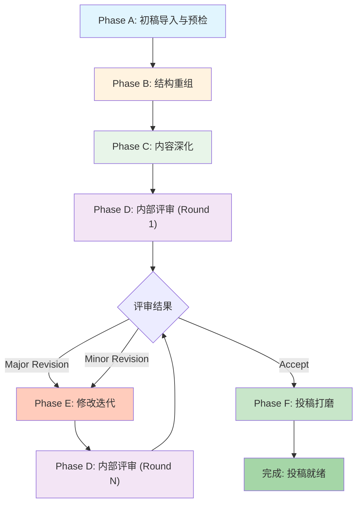

# Paper I 多智能体迭代完善方案

> **论文**: *Confidence-Aware Edge Routing for Robotic TCM Tongue Imaging: Edge-IQA and LangGraph Closed-Loop Acquisition*
> **论文路径**: `/home/ros/work/paper1/doctor/paper1`
> **目标期刊**: RA-L (IEEE Robotics and Automation Letters) / RCIM
> **当前状态**: Draft v1，已生成初稿和 Cover Letter，待导师审阅
> **目标**: 通过多智能体协作迭代，将初稿提升至 SCI 一区投稿标准

---

## 1. 现有论文分析

### 1.1 论文概况

| 项目 | 内容 |
|------|------|
| **研究主题** | 面向中医舌诊的云-边-端协作机器人舌象采集系统 |
| **核心贡献** | Edge-IQA 边侧图像质量评估 + LangGraph 置信度路由 |
| **实验平台** | Franka Research 3 (FR3) + ROS 2 + MoveIt |
| **数据集** | ShezhenV3-COCO (6,719 images) |
| **关键指标** | M1 (RTT p50): 208.3ms vs 374.0ms; M2 (Valid Rate): 0.604 vs 0.560 |

### 1.2 已有文件清单

```
paper1/
├── latex/
│   ├── main.tex                          # 主文档 (英文)
│   ├── main-zh.tex                       # 中文版
│   ├── main.pdf / main-zh.pdf            # 已编译 PDF
│   ├── references.bib                    # 参考文献 (31 条)
│   └── sections/                         # 28 个 .tex 章节文件
│       ├── 00_abstract.tex               # 摘要
│       ├── 01_intro.tex                  # 引言 (含 4 个 Contributions)
│       ├── 02_related.tex                # 相关工作
│       ├── 03_system.tex                 # 系统架构
│       ├── 04_1_edge_iqa.tex             # Edge-IQA 方法
│       ├── 04_1_roi.tex                  # ROI 裁剪
│       ├── 04_2_routing.tex              # LangGraph 路由
│       ├── 04_3_closed_loop.tex          # 闭环协议
│       ├── 05_1_setup.tex ~ 05_11_*.tex  # 实验 (11 个子节)
│       ├── 06_conclusion.tex             # 结论
│       ├── 07_supplementary.tex          # 补充材料
│       └── 08_appendix_extended.tex      # 扩展附录
├── figures/                              # 论文图 (11 个 PDF/SVG + 5 个绘图脚本)
├── experiments/                          # 实验代码与数据
├── submission/RA-L_20260529/             # 投稿材料 (Cover Letter + log)
└── edge_iqa/ & langgraph_router/         # 算法实现代码
```

### 1.3 初稿问题诊断（基于文件分析）

经过全面审阅，识别出以下待改进问题：

#### 🔴 关键问题 (Must Fix)

| ID | 问题 | 位置 | 严重性 |
|----|------|------|--------|
| C1 | **章节过多过碎**：实验部分有 11 个子节 (05_1 ~ 05_11)，远超 RA-L 8 页限制 | main.tex | 🔴 |
| C2 | **Discussion 章节冗长且碎片化**：含 17 个 `\paragraph{}`，更像随笔而非学术讨论 | 05_5_discussion.tex | 🔴 |
| C3 | **Abstract/Cover Letter 数据不一致**：Abstract 写 M1 p50=208.3ms，Cover Letter 写 397.6ms→364.7ms | 00_abstract.tex vs cover_letter.md | 🔴 |
| C4 | **参考文献质量问题**：部分条目缺 DOI、期刊名不规范（如 `journal = {CVPR}`）、引用格式混乱 | references.bib | 🔴 |
| C5 | **"Reviewer FAQ" 不应出现在论文中**：Discussion 末尾有一段 "Reviewer FAQ (anticipating)" | 05_5_discussion.tex L59-62 | 🔴 |

#### 🟡 重要问题 (Should Fix)

| ID | 问题 | 位置 | 严重性 |
|----|------|------|--------|
| M1 | **Contribution 表述不够凝练**：4 个贡献点表述偏长，可精简 | 01_intro.tex | 🟡 |
| M2 | **缺少与 SOTA 的直接对比表**：只与自己的 B0-B4 对比，缺少与其他 IQA/路由方法对比 | 05_2_main_results.tex | 🟡 |
| M3 | **Limitation 讨论不够深入**：仅 3 行，对合成模糊 vs 真实模糊的差异分析不充分 | 06_conclusion.tex | 🟡 |
| M4 | **图表引用不完整**：部分 figure 缺少交叉引用验证 | 全文 | 🟡 |
| M5 | **Author 仍为 Anonymous**，需确认投稿要求 | main.tex L18 | 🟡 |
| M6 | **Cover Letter 过于简短**，缺少编辑关注点和审稿人推荐 | cover_letter.md | 🟡 |

#### 🟢 改进建议 (Nice to Have)

| ID | 问题 | 位置 | 严重性 |
|----|------|------|--------|
| N1 | 增加 Graphical Abstract / Highlights | 缺失 | 🟢 |
| N2 | 补充 AI Disclosure Statement | 缺失 | 🟢 |
| N3 | 强化数学符号一致性审查 | 全文 | 🟢 |
| N4 | 补充 CRediT 作者贡献声明 | 缺失 | 🟢 |

---

## 2. 多智能体迭代工作流

### 2.1 针对已有初稿的简化流程

由于论文初稿已经完成，工作流从 Phase 0-3（创意→文献→方法→写作）直接跳转至**评审-修改循环**：



### 2.2 各阶段角色分配

| 阶段 | 主执行 | 协作 | 审查 |
|------|--------|------|------|
| A: 初稿预检 | 📚 Student | — | 🎓 PI |
| B: 结构重组 | 📚 Student | ✍️ Editor | 🎓 PI |
| C: 内容深化 | 📚 Student | 📊 Statistician | 🎓 PI |
| D: 内部评审 | 🔍 Reviewer A + B | 📐 Ethics | 🎓 PI |
| E: 修改迭代 | 📚 Student | ✍️ Editor | 🎓 PI |
| F: 投稿打磨 | ✍️ Editor | 📚 Student | 🎓 PI |

---

## 3. 各阶段详细任务

### Phase A: 初稿导入与预检

**目标**: 建立论文基线，识别所有待改进项

**任务清单**:

```
- [ ] A1. 扫描所有 .tex 文件，构建论文全文 Markdown 副本
- [ ] A2. 检查 Abstract 与正文数据一致性
- [ ] A3. 检查 Cover Letter 与 Abstract 数据一致性
- [ ] A4. 验证所有 \ref{} 和 \cite{} 交叉引用的完整性
- [ ] A5. 验证 references.bib 中每条引用的 DOI 和格式规范
- [ ] A6. 统计全文字数，评估是否超出 RA-L 页数限制
- [ ] A7. 生成初始质量评分报告
```

**Agent 交互流程**:

```
Student Agent:
  → 读取 latex/ 下所有 .tex 文件
  → 生成结构化预检报告 (字数统计、引用检查、数据一致性)
  → 标注每个发现的问题 ID 和严重性

PI Agent:
  → 审阅预检报告
  → 确认优先级排序
  → 批准进入下一阶段
```

### Phase B: 结构重组

**目标**: 解决 C1 (章节过多) 和 C2 (Discussion 碎片化) 问题

**核心任务**:

```
- [ ] B1. 将实验 11 个子节合并精简为 4-5 个核心子节:
        - 5.1 Experimental Setup (保留)
        - 5.2 Main Results (合并 Table II/III + 图5/6)
        - 5.3 Ablation Studies (合并 05_3 + 05_4_tcm)
        - 5.4 Discussion (重写，聚焦 3-4 个核心论点)
        - 5.5 Implementation Notes (精简移至补充材料)

- [ ] B2. 重写 Discussion，从 17 个碎片段落精炼为:
        - 主要发现的解释 (Why B2 works)
        - 与现有方法的对比分析
        - 局限性与 Threats to Validity
        - 临床转化路径

- [ ] B3. 移除 "Reviewer FAQ (anticipating)" 段落 (C5)

- [ ] B4. 将 walkthrough、deployment、failure_cases 等
        非核心内容移至 Supplementary Materials

- [ ] B5. 重新组织 main.tex 的 \input{} 顺序
```

**Agent 交互流程**:

```
Student Agent:
  → 提出结构重组方案 (合并/删除/移动的具体计划)
  → 执行重组并生成新的 main.tex

Editor Agent:
  → 审查重组后的逻辑连贯性
  → 补充过渡段落

PI Agent:
  → Gate Review: 结构是否合理？页数是否可控？
```

### Phase C: 内容深化

**目标**: 解决 M1-M6 等内容质量问题

**核心任务**:

```
- [ ] C1. 精炼 Contribution 表述 (M1):
        4 个贡献点压缩为 3 个，每个 ≤ 2 行

- [ ] C2. 补充外部方法对比 (M2):
        - 对比 NIQE、BRISQUE 等经典 IQA 方法
        - 对比其他边缘路由策略 (固定阈值、随机采样)
        → 新增 Table IV: External Comparison

- [ ] C3. 深化 Limitation 讨论 (M3):
        - 合成模糊 vs 真实运动模糊的差异分析
        - 单数据集验证的泛化性风险
        - Edge-IQA 的 feature overlap 问题量化

- [ ] C4. 修复 Abstract/Cover Letter 数据不一致 (C3):
        以实验 CSV 中的真实数据为准，统一修正

- [ ] C5. 修复参考文献格式 (C4):
        - 补充所有缺失的 DOI
        - 规范期刊/会议名称 (CVPR → {Proc. IEEE/CVF CVPR})
        - 按目标期刊要求统一引用格式

- [ ] C6. 改写 Cover Letter (M6):
        - 增加论文亮点 (3-5 bullet points)
        - 增加与期刊 scope 的关联说明
        - 建议审稿人的研究方向 (2-3 个方向)

- [ ] C7. 补充 AI Disclosure Statement (N2)
- [ ] C8. 补充 CRediT Author Contribution (N4)
```

**Statistician Agent 参与**:

```
Statistician Agent:
  → 审查 Table II/III 中的统计报告规范性
  → 检查效应量、置信区间是否充分报告
  → 检查 p 值报告是否规范 (是否需要多重比较校正)
  → 验证"3 seeds"是否足够 → 建议是否需要增加随机种子
```

### Phase D: 内部评审

**目标**: 模拟真实同行评审，产出结构化审稿意见

**审稿人配置**:

| 审稿人 | 专业视角 | 关注重点 |
|--------|---------|---------|
| Reviewer A | 机器人系统/边缘计算 | 系统架构合理性、实时性论证、工程可行性 |
| Reviewer B | 医学影像/中医诊断 | 临床价值、数据集代表性、IQA 指标合理性 |
| Ethics | 学术伦理 | 数据使用合规、AI 声明、利益冲突 |

**审稿输出格式**:

```typescript
interface Paper1ReviewReport {
  reviewer: string;
  decision: 'accept' | 'minor_revision' | 'major_revision' | 'reject';
  overallScore: number;  // 1-10
  
  // RA-L 特定评审维度
  dimensions: {
    technicalNovelty: number;      // Edge-IQA 和路由的技术新颖性
    experimentalRigor: number;     // 实验设计的严谨性
    clinicalRelevance: number;     // 临床转化的可行性
    writingQuality: number;        // 写作质量
    reproducibility: number;       // 可重复性（代码/数据）
  };
  
  majorIssues: {
    id: string;                    // e.g., "R1-M1"
    section: string;               // e.g., "Section 5.2"
    texFile: string;               // e.g., "05_2_main_results.tex"
    description: string;
    suggestion: string;
  }[];
  
  minorIssues: ReviewIssue[];
  strengths: string[];
}
```

### Phase E: 修改迭代

**目标**: 逐条回应审稿意见，生成修改稿

**迭代规则**:

- **最大轮次**: 3 轮
- **收敛条件**: 两位审稿人均评分 ≥ 7/10 且决定为 Accept 或 Minor Revision
- **输出**: 修改后的 .tex 文件 + Point-by-Point Response Letter

**Response Letter 模板**:

```markdown
# Point-by-Point Response to Reviewers

## Reviewer A

### Major Issue R1-M1: [问题标题]
**原文**: [审稿人原文]
**回应**: [我们的回应]
**修改**: Section X, Page Y, Lines Z-W (标黄)

### Minor Issue R1-m1: [问题标题]
...

## Reviewer B
...
```

### Phase F: 投稿打磨

**目标**: 生成完整的投稿材料包

**投稿材料清单**:

```
submission/RA-L_final/
├── manuscript.pdf              # 最终论文 PDF
├── manuscript_highlighted.pdf  # 修改标注版 (如有修改轮次)
├── cover_letter.pdf            # 投稿信
├── response_letter.pdf         # 审稿回复信 (如有修改轮次)
├── highlights.txt              # 论文亮点 (3-5 条)
├── graphical_abstract.pdf      # 图形摘要
├── supplementary.pdf           # 补充材料
├── ai_disclosure.txt           # AI 使用声明
├── credit_statement.txt        # 作者贡献声明
├── conflict_of_interest.txt    # 利益冲突声明
└── checklist.md                # 投稿前最终检查清单
```

---

## 4. 技术实现要点

### 4.1 论文文件读写策略

由于论文源文件为 LaTeX 格式，Agent 需要具备以下能力：

```typescript
// 专用工具: 读取论文章节
const readPaperSection = tool(
  async (input) => {
    const texPath = join(PAPER1_ROOT, "latex/sections", input.filename);
    return readFileSync(texPath, "utf-8");
  },
  {
    name: "read_paper_section",
    description: "读取论文的指定 LaTeX 章节文件",
    schema: z.object({
      filename: z.string().describe("章节文件名，如 '01_intro.tex'"),
    }),
  }
);

// 专用工具: 修改论文章节
const editPaperSection = tool(
  async (input) => {
    const texPath = join(PAPER1_ROOT, "latex/sections", input.filename);
    // 基于 diff 的精确修改，而非全文替换
    const content = readFileSync(texPath, "utf-8");
    const updated = applyPatch(content, input.patch);
    writeFileSync(texPath, updated);
    return `已修改 ${input.filename}`;
  },
  {
    name: "edit_paper_section",
    description: "修改论文的指定 LaTeX 章节文件",
    schema: z.object({
      filename: z.string().describe("章节文件名"),
      patch: z.string().describe("unified diff 格式的修改补丁"),
    }),
  }
);

// 专用工具: 编译论文
const compilePaper = tool(
  async () => {
    const result = await exec("latexmk -pdf main.tex", {
      cwd: join(PAPER1_ROOT, "latex"),
    });
    return result.stdout;
  },
  {
    name: "compile_paper",
    description: "编译 LaTeX 论文生成 PDF",
  }
);

// 专用工具: 验证参考文献
const validateReferences = tool(
  async () => {
    const bib = readFileSync(join(PAPER1_ROOT, "latex/references.bib"), "utf-8");
    // 检查每条引用的完整性
    return checkBibEntries(bib);
  },
  {
    name: "validate_references",
    description: "验证 references.bib 中所有引用的完整性和格式规范",
  }
);
```

### 4.2 论文专用编排器

```typescript
// paper-forge/orchestrator-paper1.ts

export function createPaper1Orchestrator(config: PaperForgeConfig) {
  return createDeepAgent({
    name: "paper1-orchestrator",
    systemPrompt: `
你是 Paper I 的编排器，负责协调多个智能体对论文
"Confidence-Aware Edge Routing for Robotic TCM Tongue Imaging"
进行迭代完善。

论文位于: ${PAPER1_ROOT}/latex/
当前状态: Draft v1，待迭代至投稿标准

你的职责:
1. 按 Phase A→B→C→D→E→F 顺序推进工作
2. 在每个 Phase 结束时进行 Gate Review
3. 管理 Review-Revise 迭代循环 (最多 3 轮)
4. 确保所有修改都有清晰的追踪记录
5. 最终产出完整的投稿材料包

关键约束:
- RA-L 论文限制: 6-8 页 (双栏)
- 目标: 技术新颖性 + 实验严谨性 + 可重复性
- 所有修改必须保持 LaTeX 格式的正确性
- 修改后需重新编译验证
    `,
    tools: [
      readPaperSection,
      editPaperSection,
      compilePaper,
      validateReferences,
      // ... 其他工具
    ],
    subagents: [
      piAgent,
      studentAgent,
      statisticianAgent,
      editorAgent,
      reviewerAgent1,
      reviewerAgent2,
      ethicsAgent,
    ],
    backend: new FilesystemBackend({
      rootDir: PAPER1_ROOT,
    }),
    checkpointer: config.checkpointer,
  });
}
```

### 4.3 各角色 Agent 的领域知识注入

针对 Paper I 的具体主题，各角色需要注入领域特定的知识：

```yaml
# paper1-agents.yaml

agents:
  - id: reviewer-agent-1
    name: "审稿人 A (机器人/边缘计算)"
    perspective: "robotics-edge-computing"
    domainKnowledge: |
      你熟悉以下领域:
      - 云-边-端协作机器人系统 (Cloud Robotics)
      - ROS 2 / MoveIt 运动规划
      - 边缘计算卸载策略 (Neurosurgeon, DADS 等)
      - 实时系统的时延分析方法
      你在审阅时需特别关注:
      - Edge-IQA 的计算复杂度分析是否充分
      - RTT 时延模型是否合理
      - 与 1kHz 控制循环的解耦是否被充分论证
      - JSONL 日志的审计性在工程实践中的价值

  - id: reviewer-agent-2
    name: "审稿人 B (医学影像/中医)"
    perspective: "medical-imaging-tcm"
    domainKnowledge: |
      你熟悉以下领域:
      - 医学图像质量评估 (IQA) 方法
      - 中医舌诊的临床流程和影像标准
      - 远程医疗 (Telemedicine) 的工程化挑战
      - ShezhenV3 等公开舌象数据集
      你在审阅时需特别关注:
      - Edge-IQA 评分指标是否有临床意义
      - 合成模糊 vs 真实运动模糊的代表性
      - 数据集的多样性是否足以支撑结论
      - 临床转化路径是否可行
```

---

## 5. 质量收敛标准

### 5.1 投稿前必须达到的硬性标准

| 检查项 | 标准 | 当前状态 |
|--------|------|---------|
| 全文页数 | ≤ 8 页 (双栏) | ❌ 预计超标 (28 个 section 文件) |
| Abstract 字数 | ≤ 300 words | ⚠️ 需检查 |
| 数据一致性 | Abstract = Table = Cover Letter | ❌ 不一致 |
| 参考文献格式 | 全部有 DOI + 规范格式 | ❌ 多处不规范 |
| 交叉引用完整 | 0 个 undefined ref | ⚠️ 需验证 |
| LaTeX 编译 | 0 error, 0 warning | ⚠️ 需验证 |
| AI Disclosure | 已声明 | ❌ 缺失 |
| Cover Letter | ≥ 1 页，含亮点和 scope 说明 | ❌ 过于简短 |

### 5.2 审稿人评分收敛条件

```
终止条件 = (
  reviewer_1.score >= 7 AND
  reviewer_2.score >= 7 AND
  reviewer_1.decision IN ('accept', 'minor_revision') AND
  reviewer_2.decision IN ('accept', 'minor_revision') AND
  ethics.passed == true AND
  pi.approved == true
)
OR iteration_count >= 3
```

### 5.3 各维度最低评分要求

| 维度 | 最低分 | 说明 |
|------|--------|------|
| 技术新颖性 | ≥ 6 | Edge-IQA + LangGraph 路由的组合新颖性 |
| 实验严谨性 | ≥ 7 | 数据集规模、基线对比、消融实验 |
| 临床相关性 | ≥ 5 | 作为系统论文，临床部分可适度弱化 |
| 写作质量 | ≥ 7 | 结构清晰、逻辑连贯、语言规范 |
| 可重复性 | ≥ 8 | 代码+数据+脚本齐全，这是论文优势 |

---

## 6. 实施路线图

### 6.1 分步执行计划

| 步骤 | 任务 | 预计耗时 | 依赖 |
|------|------|---------|------|
| **Step 1** | 构建 Paper Forge 核心框架 (编排器 + 工具) | 3 天 | 无 |
| **Step 2** | 实现 Paper I 专用 Agent 配置 | 2 天 | Step 1 |
| **Step 3** | Phase A 执行: 初稿预检 | 1 天 | Step 2 |
| **Step 4** | Phase B 执行: 结构重组 | 2 天 | Step 3 |
| **Step 5** | Phase C 执行: 内容深化 | 3 天 | Step 4 |
| **Step 6** | Phase D+E 执行: 评审+修改 (≤3轮) | 3-5 天 | Step 5 |
| **Step 7** | Phase F 执行: 投稿打磨 | 1 天 | Step 6 |

### 6.2 可立即启动的快速修复

即使不等待完整系统搭建，以下问题可立即通过单 Agent 修复：

```
优先级 P0 (立即修复):
  ✂️ 删除 Discussion 中的 "Reviewer FAQ" 段落 (C5)
  🔢 修正 Abstract/Cover Letter 数据不一致 (C3)
  📚 修复 references.bib 格式问题 (C4)

优先级 P1 (短期修复):
  📐 结构重组: 合并实验子节 (C1)
  ✍️ 重写 Discussion (C2)
  📝 增强 Cover Letter (M6)

优先级 P2 (迭代修复):
  📊 补充外部方法对比 (M2)
  🧮 深化统计分析 (Statistician 参与)
  ✅ 补充 AI Disclosure + CRediT (N2, N4)
```

---

## 7. 与通用 Paper Forge 框架的关系

本方案是 [多智能体协作论文生产系统设计.md](./多智能体协作论文生产系统设计.md) 中通用框架的**第一个实例化应用**。

```
通用框架 (Paper Forge)          Paper I 实例化
──────────────────              ─────────────────
7 个阶段 Phase 0-7     →       6 个阶段 Phase A-F (跳过创意和写作)
通用角色提示词           →       注入机器人/中医舌诊领域知识
通用工具 (文献检索等)    →       LaTeX 读写/编译专用工具
从零开始写论文           →       从已有初稿迭代优化
```

通过 Paper I 的实践，我们将验证和完善通用框架的设计，形成可复用的最佳实践模式。
