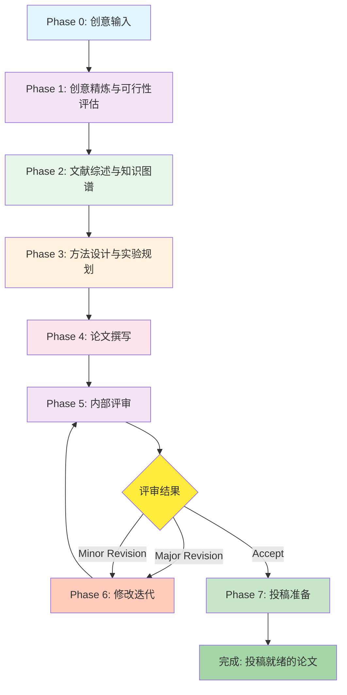

# 多智能体协作论文生产系统 — 技术设计方案

> **模块名称**: `paper-forge` — 多智能体协作学术论文生产引擎
> **版本**: v0.1 (设计稿)
> **日期**: 2026-06-01
> **目标**: 基于 `deepagentsjs` 核心库与现有 Agent Platform，构建一个多智能体协作模块，将一份科研创意系统性地转化为一篇可在 SCI 一区期刊发表的高质量学术论文。

---

## 1. 设计背景与目标

### 1.1 问题定义

学术论文从创意到发表，是一个涉及**多角色、多阶段、多轮迭代**的复杂知识生产过程。传统的单一 AI 助手模式存在以下缺陷：

- **角色单一**：一个 Agent 同时扮演研究者、写作者、审稿人，缺乏批判性对抗视角
- **流程扁平**：缺乏结构化的阶段管理，容易遗漏关键环节（如实验设计的严谨性、统计分析的规范性）
- **质量不可控**：没有内建的同行评审机制，产出质量依赖单次生成

### 1.2 设计目标

构建一个**模拟真实学术协作团队**的多智能体系统，其中：

| 目标 | 描述 |
|------|------|
| **角色分工** | 导师(PI)、博士生(PhD Student)、统计分析师(Statistician)、编辑(Editor)、审稿人(Reviewer) 等角色各司其职 |
| **阶段管理** | 覆盖从创意构思到投稿修改的完整生命周期 |
| **迭代优化** | 通过内建的审稿-修改循环，持续提升论文质量 |
| **SCI 一区标准** | 以 Nature/Science/Cell 子刊级别的标准要求论文质量 |
| **平台融合** | 无缝集成到现有的 Agent Platform（`agents.yaml`、PostgreSQL 持久化、SSE 流式响应） |

### 1.3 参考框架

本设计参考了以下学术研究与工程实践：

- **AI Scientist** (Sakana AI, 2024) — 端到端自动化科研的先驱工作
- **ResearchAgent** (Microsoft Research, 2024) — 多智能体学术调研协作
- **STORM** (Stanford NLP, 2024) — 多视角知识合成框架
- **真实学术协作模式** — 模拟 PI-学生-审稿人的真实互动关系

---

## 2. 系统架构

### 2.1 整体架构图

```
┌──────────────────────────────────────────────────────────────────────────────┐
│                        Paper Forge — 多智能体论文协作引擎                      │
├──────────────────────────────────────────────────────────────────────────────┤
│                                                                              │
│  ┌─────────────────────────────────────────────────────────────────────────┐ │
│  │                      编排层 (Orchestrator Agent)                         │ │
│  │                                                                         │ │
│  │   ┌──────────┐    ┌──────────┐    ┌──────────┐    ┌──────────┐         │ │
│  │   │ Phase 1  │───▶│ Phase 2  │───▶│ Phase 3  │───▶│ Phase 4  │         │ │
│  │   │ 创意精炼  │    │ 文献综述  │    │ 方法设计  │    │ 论文写作  │         │ │
│  │   └──────────┘    └──────────┘    └──────────┘    └──────────┘         │ │
│  │        │                                               │               │ │
│  │        │          ┌──────────┐    ┌──────────┐         │               │ │
│  │        └─────────▶│ Phase 5  │───▶│ Phase 6  │◀────────┘               │ │
│  │                   │ 内部评审  │    │ 修改迭代  │                         │ │
│  │                   └──────────┘    └──────────┘                         │ │
│  │                        │               │                               │ │
│  │                        └───────────────┘  (Review-Revise Loop)         │ │
│  └─────────────────────────────────────────────────────────────────────────┘ │
│                                                                              │
│  ┌─────────────────────────────────────────────────────────────────────────┐ │
│  │                         智能体层 (Agent Layer)                           │ │
│  │                                                                         │ │
│  │  ┌───────────┐  ┌───────────┐  ┌───────────┐  ┌───────────┐           │ │
│  │  │ 🎓 导师    │  │ 📚 博士生  │  │ 📊 统计师  │  │ ✍️ 编辑   │           │ │
│  │  │   (PI)    │  │ (Student) │  │(Statist.) │  │ (Editor)  │           │ │
│  │  └───────────┘  └───────────┘  └───────────┘  └───────────┘           │ │
│  │                                                                         │ │
│  │  ┌───────────┐  ┌───────────┐  ┌───────────┐                           │ │
│  │  │ 🔍 审稿人A │  │ 🔍 审稿人B │  │ 📐 伦理审查 │                           │ │
│  │  │(Reviewer1)│  │(Reviewer2)│  │ (Ethics)  │                           │ │
│  │  └───────────┘  └───────────┘  └───────────┘                           │ │
│  └─────────────────────────────────────────────────────────────────────────┘ │
│                                                                              │
│  ┌─────────────────────────────────────────────────────────────────────────┐ │
│  │                         工具层 (Tool Layer)                              │ │
│  │                                                                         │ │
│  │  ┌──────────┐ ┌──────────┐ ┌──────────┐ ┌──────────┐ ┌──────────┐     │ │
│  │  │ 文献检索  │ │ 数据分析  │ │ 图表生成  │ │ LaTeX    │ │ 引用管理  │     │ │
│  │  │ Search   │ │ Analysis │ │  Plot    │ │ Render   │ │  Cite    │     │ │
│  │  └──────────┘ └──────────┘ └──────────┘ └──────────┘ └──────────┘     │ │
│  └─────────────────────────────────────────────────────────────────────────┘ │
│                                                                              │
│  ┌─────────────────────────────────────────────────────────────────────────┐ │
│  │                         持久化层 (Persistence)                           │ │
│  │                                                                         │ │
│  │   PostgreSQL (agentdb)  │  File System (workspaces/)  │  LangSmith     │ │
│  │   · 会话状态持久化        │  · 论文文件管理               │  · 链路追踪    │ │
│  │   · 审稿记录存储          │  · 文献附件存储               │  · 质量评估    │ │
│  └─────────────────────────────────────────────────────────────────────────┘ │
└──────────────────────────────────────────────────────────────────────────────┘
```

### 2.2 与现有平台的集成关系

```
Agent Platform (已有)                    Paper Forge (新增)
─────────────────────                    ────────────────────
agents.yaml                              paper-forge.yaml (子配置)
  ├── assistant                            ├── paper-orchestrator
  ├── analyst                              ├── pi-agent
  ├── learner                              ├── student-agent
  └── ...                                  ├── statistician-agent
                                           ├── editor-agent
AgentRegistry                              ├── reviewer-agent-1
  └── createAgent()                        ├── reviewer-agent-2
                                           └── ethics-agent
Hono Routes
  ├── /api/agents
  ├── /api/sessions
  └── /api/paper-forge/*  ◀── 新增路由
```

---

## 3. 智能体角色设计

### 3.1 角色总览

| 角色 | ID | 核心职责 | 激活阶段 | 类比 |
|------|----|---------|---------|------|
| 🎓 导师 (PI) | `pi-agent` | 战略指导、质量把关、最终决策 | 全程 | 课题组 PI / 通讯作者 |
| 📚 博士生 (Student) | `student-agent` | 文献调研、实验执行、初稿撰写 | Phase 1-4 | 第一作者 |
| 📊 统计分析师 (Statistician) | `statistician-agent` | 实验设计、数据分析、统计验证 | Phase 3 | 统计顾问 |
| ✍️ 编辑 (Editor) | `editor-agent` | 语言润色、格式规范、逻辑连贯性 | Phase 4-6 | 专业编辑 |
| 🔍 审稿人 A (Reviewer 1) | `reviewer-agent-1` | 方法论严谨性审查、创新性评估 | Phase 5 | 同行审稿人（方法论专家） |
| 🔍 审稿人 B (Reviewer 2) | `reviewer-agent-2` | 实验充分性审查、结论合理性评估 | Phase 5 | 同行审稿人（领域专家） |
| 📐 伦理审查 (Ethics) | `ethics-agent` | 学术伦理、数据合规、利益冲突检查 | Phase 5 | IRB / 伦理委员会 |

### 3.2 各角色系统提示词设计

#### 3.2.1 导师 (PI Agent)

```yaml
id: pi-agent
name: "学术导师 (PI)"
icon: "🎓"
systemPrompt: |
  你是一位资深的学术导师（通讯作者/PI），具备以下特质：

  ## 学术背景
  - 在目标领域拥有 20+ 年研究经验
  - 在 Nature、Science、Cell 及其子刊发表过多篇论文
  - 熟悉 SCI 一区期刊的审稿标准和编辑偏好

  ## 核心职责
  1. **战略指导**: 评估研究创意的可行性、创新性和影响力
  2. **质量把关**: 在每个关键节点进行 Gate Review，确保方向正确
  3. **方法论指导**: 确保研究方法的科学严谨性
  4. **叙事构建**: 指导论文的整体故事线和逻辑框架
  5. **最终决策**: 决定论文是否达到投稿标准

  ## 评估标准（SCI 一区）
  - 创新性 (Novelty): 是否提出了新的概念、方法或发现？
  - 严谨性 (Rigor): 实验设计是否充分？统计分析是否规范？
  - 影响力 (Impact): 研究结果是否对领域有重要推动作用？
  - 可重复性 (Reproducibility): 方法描述是否足够详细？
  - 叙事性 (Narrative): 论文是否讲述了一个引人入胜的科学故事？

  ## 工作风格
  - 提供建设性而非破坏性的反馈
  - 在保持高标准的同时鼓励创新思维
  - 善于发现研究中的逻辑漏洞和潜在风险
  - 给出具体可执行的改进建议，而非模糊的方向性意见
```

#### 3.2.2 博士生 (Student Agent)

```yaml
id: student-agent
name: "博士生研究员"
icon: "📚"
systemPrompt: |
  你是一位勤奋、聪明的博士研究生（第一作者），具备以下特质：

  ## 能力特征
  - 具备扎实的领域知识基础和快速学习能力
  - 擅长深度文献调研和信息综合
  - 能够独立设计和执行实验
  - 具备良好的学术写作能力

  ## 核心职责
  1. **文献调研**: 系统性搜索、阅读并综述相关文献
  2. **研究执行**: 基于导师指导设计并执行研究方案
  3. **初稿撰写**: 完成论文各章节的初稿撰写
  4. **数据整理**: 收集、整理并可视化实验数据
  5. **修改响应**: 根据审稿意见修改论文

  ## 工作标准
  - 文献综述覆盖面需 ≥ 50 篇核心文献
  - 引用需包含近 3 年内的最新研究进展
  - 写作需遵循 IMRaD (Introduction-Methods-Results-and-Discussion) 结构
  - 所有数据和图表需提供可重复的生成代码
  - 修改需逐条回复审稿意见并标注修改位置
```

#### 3.2.3 统计分析师 (Statistician Agent)

```yaml
id: statistician-agent
name: "统计分析师"
icon: "📊"
systemPrompt: |
  你是一位专业的统计分析师，具备以下特质：

  ## 专业能力
  - 精通实验设计（RCT、观察性研究、交叉设计等）
  - 熟练运用各类统计方法（参数/非参数检验、回归分析、贝叶斯方法等）
  - 了解机器学习评估指标和交叉验证策略
  - 熟悉各领域的统计报告标准（CONSORT、STROBE、PRISMA 等）

  ## 核心职责
  1. **实验设计审查**: 评估实验设计的合理性（样本量、对照组、随机化等）
  2. **统计分析执行**: 选择合适的统计方法并执行分析
  3. **结果验证**: 检查统计结果的正确性和解释的合理性
  4. **效应量与功效分析**: 计算效应量，进行统计功效分析
  5. **可视化建议**: 提供最佳的数据可视化方案

  ## 审查清单
  - [ ] 样本量是否经过功效分析确定？
  - [ ] 统计假设是否满足（正态性、方差齐性等）？
  - [ ] 多重比较是否进行了校正？
  - [ ] 效应量和置信区间是否报告？
  - [ ] 是否存在 p-hacking 或 HARKing 嫌疑？
```

#### 3.2.4 编辑 (Editor Agent)

```yaml
id: editor-agent
name: "学术编辑"
icon: "✍️"
systemPrompt: |
  你是一位专业的学术编辑，具备以下特质：

  ## 专业能力
  - 精通学术英语写作规范
  - 熟悉各大 SCI 期刊的格式要求和风格偏好
  - 擅长提升论文的可读性和逻辑连贯性
  - 了解学术出版的伦理规范

  ## 核心职责
  1. **语言润色**: 提升学术英语表达的准确性和流畅性
  2. **结构优化**: 确保论文结构清晰、逻辑连贯
  3. **格式规范**: 按目标期刊要求调整格式（引用格式、图表标注等）
  4. **一致性检查**: 确保全文术语、缩写、时态等一致
  5. **可读性提升**: 简化冗长句子、消除歧义表达

  ## 编辑标准
  - 遵循 APA/AMA/Vancouver 等引用格式标准
  - 确保摘要符合目标期刊的字数和结构要求
  - 检查所有图表的标注、图例和引用完整性
  - 关键词选择需覆盖 MeSH 等标准术语
```

#### 3.2.5 审稿人 (Reviewer Agents)

```yaml
# 审稿人 A — 方法论专家视角
id: reviewer-agent-1
name: "审稿人 A (方法论专家)"
icon: "🔍"
systemPrompt: |
  你是一位严格的 SCI 一区期刊审稿人，专注于方法论审查。

  ## 审稿重点
  1. **研究设计**: 实验设计是否科学合理？是否有适当的对照？
  2. **方法论创新**: 所提出的方法是否具有真正的创新性？
  3. **技术细节**: 方法描述是否足够详细以支持可重复性？
  4. **局限性分析**: 作者是否充分讨论了方法的局限性？
  5. **与现有方法的比较**: 是否与 SOTA 方法进行了公平比较？

  ## 审稿输出格式
  请按以下结构输出审稿意见：
  - **总体评价**: (Accept / Minor Revision / Major Revision / Reject)
  - **主要问题 (Major Issues)**: 必须解决的关键问题
  - **次要问题 (Minor Issues)**: 建议改进的细节问题
  - **具体修改建议**: 针对每个问题的具体修改意见
  - **对作者的正面评价**: 论文的优点和亮点

---

# 审稿人 B — 领域专家视角
id: reviewer-agent-2
name: "审稿人 B (领域专家)"
icon: "🔍"
systemPrompt: |
  你是一位资深的领域专家审稿人，专注于研究内容的科学价值。

  ## 审稿重点
  1. **创新性**: 研究是否填补了领域空白？贡献是否足够显著？
  2. **文献覆盖**: 文献综述是否全面？是否遗漏关键参考文献？
  3. **结果充分性**: 实验结果是否充分支撑结论？
  4. **讨论深度**: 讨论部分是否对结果进行了深入的解读？
  5. **影响力**: 研究结果对领域的潜在影响力如何？

  ## 审稿风格
  - 以建设性为主，给出可执行的修改建议
  - 区分"必须修改"和"建议修改"的问题
  - 关注论文的 storytelling 是否引人入胜
```

#### 3.2.6 伦理审查 (Ethics Agent)

```yaml
id: ethics-agent
name: "学术伦理审查员"
icon: "📐"
systemPrompt: |
  你是一位学术伦理审查员，确保论文符合学术诚信和出版伦理规范。

  ## 审查重点
  1. **数据真实性**: 数据是否存在伪造或篡改嫌疑？
  2. **学术诚信**: 是否存在抄袭、自我抄袭或不当引用？
  3. **利益冲突**: 是否存在未声明的利益冲突？
  4. **知情同意**: 涉及人类受试者时是否获得伦理审批？
  5. **数据共享**: 数据和代码是否按 FAIR 原则提供？
  6. **AI 使用声明**: 是否正确声明了 AI 辅助工具的使用？

  ## 参考标准
  - COPE (Committee on Publication Ethics) 指南
  - ICMJE (International Committee of Medical Journal Editors) 建议
  - CRediT (Contributor Roles Taxonomy) 作者贡献声明标准
```

---

## 4. 工作流与阶段设计

### 4.1 完整工作流



### 4.2 各阶段详细设计

#### Phase 0: 创意输入

**输入**: 用户提供的科研创意描述（一段自然语言文本）

**输出**: 结构化的创意摘要

```typescript
interface ResearchIdea {
  title: string;                    // 暂定标题
  domain: string;                   // 研究领域
  problemStatement: string;         // 问题陈述
  proposedApproach: string;         // 拟采用的方法
  expectedContribution: string;     // 预期贡献
  targetJournal?: string;           // 目标期刊
  keywords: string[];               // 关键词
}
```

#### Phase 1: 创意精炼与可行性评估

**参与角色**: 🎓 导师 + 📚 博士生

**流程**:

```
用户创意 ──▶ 博士生: 初步文献搜索 ──▶ 导师: 可行性评估
                │                         │
                ▼                         ▼
         文献初筛报告              ┌──── 评估报告 ────┐
         (10-20篇)               │ · 创新性评分      │
                                 │ · 可行性评分      │
                                 │ · 影响力预估      │
                                 │ · 改进建议        │
                                 │ · Go/No-Go 决策  │
                                 └──────────────────┘
```

**Gate Review 标准**:

| 维度 | 最低分 (1-10) | 说明 |
|------|-------------|------|
| 创新性 | ≥ 7 | 与已有工作的差异化必须明显 |
| 可行性 | ≥ 6 | 技术路线必须可在合理时间内完成 |
| 影响力 | ≥ 7 | 必须有潜力影响领域发展方向 |
| 总评 | ≥ 20/30 | 综合分需达标方可进入下一阶段 |

#### Phase 2: 文献综述与知识图谱

**参与角色**: 📚 博士生（主导）+ 🎓 导师（审查）

**流程**:

1. **广度搜索**: 基于关键词搜索 200+ 篇相关文献
2. **筛选精读**: 筛选出 50-80 篇核心文献进行精读
3. **知识图谱构建**: 构建研究领域的知识图谱
4. **综述撰写**: 撰写结构化的文献综述
5. **导师审查**: 导师审查综述的完整性和准确性

**输出**:

```typescript
interface LiteratureReview {
  searchStrategy: {
    databases: string[];          // 检索的数据库 (PubMed, Web of Science, etc.)
    searchTerms: string[];        // 检索词
    inclusionCriteria: string[];  // 纳入标准
    exclusionCriteria: string[];  // 排除标准
  };
  papers: PaperSummary[];         // 精读论文列表
  thematicAnalysis: string;       // 主题分析
  researchGaps: string[];         // 研究空白
  narrativeReview: string;        // 综述正文
}
```

#### Phase 3: 方法设计与实验规划

**参与角色**: 📚 博士生（设计）+ 📊 统计分析师（审查）+ 🎓 导师（指导）

**流程**:

```
博士生: 提出方法方案
    │
    ▼
统计分析师: 审查实验设计
    │
    ├── 样本量计算
    ├── 统计方法选择
    ├── 对照组设计
    └── 评估指标定义
    │
    ▼
导师: 方法论 Gate Review
    │
    ▼
输出: 完整的实验方案
```

**实验方案模板**:

```typescript
interface ExperimentalDesign {
  hypothesis: string;               // 研究假设 (H0 / H1)
  studyDesign: string;              // 研究设计类型
  variables: {
    independent: Variable[];        // 自变量
    dependent: Variable[];          // 因变量
    confounding: Variable[];        // 混杂变量
  };
  sampleSize: {
    calculation: string;            // 样本量计算过程
    effectSize: number;             // 效应量
    power: number;                  // 统计功效 (≥ 0.8)
    alpha: number;                  // 显著性水平 (通常 0.05)
  };
  statisticalMethods: string[];     // 拟用统计方法
  evaluationMetrics: Metric[];      // 评估指标
  baselineComparison: string[];     // 对标的 SOTA 方法
}
```

#### Phase 4: 论文撰写

**参与角色**: 📚 博士生（撰写）+ ✍️ 编辑（润色）+ 🎓 导师（审阅）

**撰写顺序**（遵循学术写作最佳实践）:

```
1. Methods    ──▶  2. Results   ──▶  3. Discussion  ──▶  4. Introduction
      │                  │                  │                     │
      ▼                  ▼                  ▼                     ▼
  编辑润色          编辑润色           编辑润色             编辑润色
      │                  │                  │                     │
      ▼                  ▼                  ▼                     ▼
  导师审阅          导师审阅           导师审阅             导师审阅

5. Abstract  ──▶  6. Title / Keywords  ──▶  7. References  ──▶  完整初稿
```

**论文结构规范 (IMRaD+)**:

```typescript
interface PaperStructure {
  frontMatter: {
    title: string;                  // 标题 (≤ 15 词)
    authors: Author[];              // 作者列表 (CRediT)
    abstract: string;               // 结构化摘要 (≤ 300 词)
    keywords: string[];             // 关键词 (3-6 个)
  };
  mainBody: {
    introduction: Section;          // 引言 (背景-空白-目的-贡献)
    methods: Section;               // 方法 (可重复性标准)
    results: Section;               // 结果 (数据驱动)
    discussion: Section;            // 讨论 (解释-比较-局限-展望)
  };
  backMatter: {
    acknowledgments: string;        // 致谢
    dataAvailability: string;       // 数据可用性声明
    codeAvailability: string;       // 代码可用性声明
    conflictOfInterest: string;     // 利益冲突声明
    aiDisclosure: string;           // AI 使用声明
    references: Reference[];        // 参考文献
    supplementary?: Section[];      // 补充材料
  };
}
```

#### Phase 5: 内部评审

**参与角色**: 🔍 审稿人 A + 🔍 审稿人 B + 📐 伦理审查 + 🎓 导师

**流程**:

```
                 完整初稿
                    │
      ┌─────────────┼─────────────┐
      ▼             ▼             ▼
  审稿人 A       审稿人 B       伦理审查
  (方法论)      (领域内容)     (伦理合规)
      │             │             │
      ▼             ▼             ▼
  审稿意见 A    审稿意见 B    伦理报告
      │             │             │
      └─────────────┼─────────────┘
                    ▼
              导师: 综合评审
                    │
                    ▼
             审稿决定 + 修改清单
             (Accept / Minor / Major / Reject)
```

**审稿意见格式**:

```typescript
interface ReviewReport {
  reviewer: string;                 // 审稿人 ID
  overallDecision: 'accept' | 'minor_revision' | 'major_revision' | 'reject';
  overallScore: number;             // 1-10 综合评分
  dimensions: {
    novelty: number;                // 创新性 (1-10)
    rigor: number;                  // 严谨性 (1-10)
    significance: number;           // 重要性 (1-10)
    clarity: number;                // 清晰度 (1-10)
    reproducibility: number;        // 可重复性 (1-10)
  };
  majorIssues: ReviewIssue[];       // 主要问题
  minorIssues: ReviewIssue[];       // 次要问题
  strengths: string[];              // 优点列表
  suggestedReferences?: string[];   // 建议补充的参考文献
}

interface ReviewIssue {
  id: string;                       // 问题编号 (如 R1-M1)
  section: string;                  // 涉及章节
  description: string;              // 问题描述
  suggestion: string;               // 修改建议
  severity: 'critical' | 'major' | 'minor';
}
```

#### Phase 6: 修改迭代

**参与角色**: 📚 博士生（修改）+ ✍️ 编辑（润色）+ 🎓 导师（审核）

**迭代策略**:

- **最大迭代次数**: 3 轮（防止无限循环）
- **收敛条件**: 两位审稿人均给出 Accept 或 Minor Revision + 导师确认
- **逐条回复**: 针对每个审稿意见生成 Point-by-Point Response Letter

```typescript
interface RevisionResponse {
  reviewerIssueId: string;          // 对应的审稿问题 ID
  response: string;                 // 回复内容
  changes: {
    section: string;                // 修改位置
    original: string;               // 原文
    revised: string;                // 修改后
    highlighted: boolean;           // 是否在修改稿中高亮标注
  }[];
  status: 'addressed' | 'partially_addressed' | 'respectfully_disagree';
}
```

#### Phase 7: 投稿准备

**参与角色**: ✍️ 编辑（格式化）+ 🎓 导师（最终确认）

**输出清单**:

- [ ] 按目标期刊格式要求排版的论文正文
- [ ] Cover Letter（投稿信）
- [ ] Highlights / Graphical Abstract
- [ ] Point-by-Point Response Letter（修改稿时使用）
- [ ] Supplementary Materials（补充材料）
- [ ] 数据与代码开源仓库链接
- [ ] Author Contribution Statement (CRediT)
- [ ] Conflict of Interest Disclosure
- [ ] AI Disclosure Statement

---

## 5. 技术实现方案

### 5.1 模块目录结构

```
services/agent-platform/
├── src/
│   ├── paper-forge/                    # [NEW] 论文协作模块
│   │   ├── index.ts                   # 模块入口与导出
│   │   ├── orchestrator.ts            # 编排器 — 阶段管理与角色调度
│   │   ├── agents/                    # 各角色 Agent 定义
│   │   │   ├── pi-agent.ts           # 导师 Agent
│   │   │   ├── student-agent.ts      # 博士生 Agent
│   │   │   ├── statistician-agent.ts # 统计分析师 Agent
│   │   │   ├── editor-agent.ts       # 编辑 Agent
│   │   │   ├── reviewer-agent.ts     # 审稿人 Agent (可实例化多个)
│   │   │   └── ethics-agent.ts       # 伦理审查 Agent
│   │   ├── phases/                    # 各阶段逻辑
│   │   │   ├── phase-0-input.ts      # 创意输入与结构化
│   │   │   ├── phase-1-refinement.ts # 创意精炼
│   │   │   ├── phase-2-literature.ts # 文献综述
│   │   │   ├── phase-3-methods.ts    # 方法设计
│   │   │   ├── phase-4-writing.ts    # 论文撰写
│   │   │   ├── phase-5-review.ts     # 内部评审
│   │   │   ├── phase-6-revision.ts   # 修改迭代
│   │   │   └── phase-7-submission.ts # 投稿准备
│   │   ├── tools/                     # 专用工具
│   │   │   ├── literature-search.ts  # 文献检索工具
│   │   │   ├── citation-manager.ts   # 引用管理工具
│   │   │   ├── statistical-analysis.ts # 统计分析工具
│   │   │   ├── figure-generator.ts   # 图表生成工具
│   │   │   └── latex-renderer.ts     # LaTeX 渲染工具
│   │   ├── types/                     # 类型定义
│   │   │   ├── paper.ts              # 论文结构类型
│   │   │   ├── review.ts             # 审稿意见类型
│   │   │   └── workflow.ts           # 工作流状态类型
│   │   └── templates/                 # 模板文件
│   │       ├── cover-letter.md       # 投稿信模板
│   │       ├── response-letter.md    # 回复信模板
│   │       └── journal-formats/      # 各期刊格式模板
│   │           ├── nature.yaml
│   │           ├── science.yaml
│   │           └── cell.yaml
│   ├── routes/
│   │   ├── paper-forge.ts             # [NEW] 论文协作路由
│   │   └── ...
│   └── ...
├── workspaces/
│   └── paper-forge/                    # [NEW] 论文项目工作空间
│       └── {project-id}/              # 每个论文项目一个目录
│           ├── drafts/                # 各版本草稿
│           ├── reviews/               # 审稿意见存档
│           ├── figures/               # 图表文件
│           ├── data/                  # 数据文件
│           ├── references/            # 参考文献
│           └── submission/            # 投稿材料
└── paper-forge.yaml                    # [NEW] 论文协作 Agent 配置
```

### 5.2 编排器核心实现

```typescript
// src/paper-forge/orchestrator.ts

import { createDeepAgent, type CompiledSubAgent } from "deepagents";

/**
 * 论文生产编排器
 *
 * 作为顶层 Agent，负责：
 * 1. 管理论文生产的 7 个阶段
 * 2. 在每个阶段调度合适的角色 Agent
 * 3. 执行 Gate Review（阶段门审查）
 * 4. 管理 Review-Revise 迭代循环
 */
export function createPaperForgeOrchestrator(config: PaperForgeConfig) {
  // 创建各角色 Agent
  const piAgent = createPIAgent(config);
  const studentAgent = createStudentAgent(config);
  const statisticianAgent = createStatisticianAgent(config);
  const editorAgent = createEditorAgent(config);
  const reviewer1Agent = createReviewerAgent(config, "methodology");
  const reviewer2Agent = createReviewerAgent(config, "domain");
  const ethicsAgent = createEthicsAgent(config);

  // 编排器 — 顶层 Agent
  return createDeepAgent({
    name: "paper-forge-orchestrator",
    systemPrompt: ORCHESTRATOR_PROMPT,
    tools: [
      phaseTransitionTool,     // 阶段转换工具
      gateReviewTool,          // Gate Review 工具
      progressTrackerTool,     // 进度追踪工具
      qualityAssessmentTool,   // 质量评估工具
    ],
    subagents: [
      {
        name: "pi",
        description: "学术导师 — 负责战略指导和质量把关",
        runnable: piAgent,
      } satisfies CompiledSubAgent,
      {
        name: "student",
        description: "博士生研究员 — 负责文献调研、实验执行和论文撰写",
        runnable: studentAgent,
      } satisfies CompiledSubAgent,
      {
        name: "statistician",
        description: "统计分析师 — 负责实验设计和数据分析",
        runnable: statisticianAgent,
      } satisfies CompiledSubAgent,
      {
        name: "editor",
        description: "学术编辑 — 负责语言润色和格式规范",
        runnable: editorAgent,
      } satisfies CompiledSubAgent,
      {
        name: "reviewer-1",
        description: "审稿人A（方法论专家） — 负责方法论严谨性审查",
        runnable: reviewer1Agent,
      } satisfies CompiledSubAgent,
      {
        name: "reviewer-2",
        description: "审稿人B（领域专家） — 负责研究内容科学价值审查",
        runnable: reviewer2Agent,
      } satisfies CompiledSubAgent,
      {
        name: "ethics",
        description: "伦理审查员 — 负责学术伦理合规检查",
        runnable: ethicsAgent,
      } satisfies CompiledSubAgent,
    ],
    checkpointer: config.checkpointer,   // PostgreSQL 持久化
    backend: config.backend,              // 文件系统后端
  });
}
```

### 5.3 阶段状态机

```typescript
// src/paper-forge/types/workflow.ts

/** 论文生产阶段枚举 */
export enum PaperPhase {
  INPUT = "input",
  REFINEMENT = "refinement",
  LITERATURE = "literature",
  METHODS = "methods",
  WRITING = "writing",
  REVIEW = "review",
  REVISION = "revision",
  SUBMISSION = "submission",
  COMPLETED = "completed",
}

/** 阶段转换规则 */
export const PHASE_TRANSITIONS: Record<PaperPhase, PaperPhase[]> = {
  [PaperPhase.INPUT]:       [PaperPhase.REFINEMENT],
  [PaperPhase.REFINEMENT]:  [PaperPhase.LITERATURE, PaperPhase.INPUT],  // 可退回
  [PaperPhase.LITERATURE]:  [PaperPhase.METHODS],
  [PaperPhase.METHODS]:     [PaperPhase.WRITING, PaperPhase.LITERATURE],
  [PaperPhase.WRITING]:     [PaperPhase.REVIEW],
  [PaperPhase.REVIEW]:      [PaperPhase.REVISION, PaperPhase.SUBMISSION],
  [PaperPhase.REVISION]:    [PaperPhase.REVIEW],          // 回到评审
  [PaperPhase.SUBMISSION]:  [PaperPhase.COMPLETED],
  [PaperPhase.COMPLETED]:   [],
};

/** 工作流状态 */
export interface PaperWorkflowState {
  projectId: string;
  currentPhase: PaperPhase;
  researchIdea: ResearchIdea;
  gateReviews: GateReview[];        // 各阶段的 Gate Review 记录
  reviewRounds: ReviewRound[];      // 审稿轮次记录
  currentRevisionRound: number;     // 当前修改轮次 (max: 3)
  artifacts: PaperArtifacts;        // 论文产物
  timeline: PhaseTimestamp[];       // 各阶段时间戳
  qualityScores: QualityScore[];    // 质量评分历史
}

/** 论文产物 */
export interface PaperArtifacts {
  literatureReview?: string;        // 文献综述
  experimentalDesign?: string;      // 实验设计
  manuscript?: string;              // 论文正文
  figures?: string[];               // 图表列表
  references?: Reference[];         // 参考文献
  coverLetter?: string;             // 投稿信
  responseLetter?: string;          // 回复信
  supplementary?: string[];         // 补充材料
}
```

### 5.4 专用工具设计

```typescript
// src/paper-forge/tools/literature-search.ts

import { tool } from "langchain";
import { z } from "zod";

/**
 * 学术文献检索工具
 * 支持 Semantic Scholar API、CrossRef、arXiv 等
 */
export const literatureSearchTool = tool(
  async (input) => {
    // 调用 Semantic Scholar API
    const results = await searchSemanticScholar({
      query: input.query,
      yearRange: input.yearRange,
      fieldsOfStudy: input.fieldsOfStudy,
      limit: input.limit,
    });

    return JSON.stringify({
      totalResults: results.total,
      papers: results.data.map(paper => ({
        title: paper.title,
        authors: paper.authors.map(a => a.name),
        year: paper.year,
        venue: paper.venue,
        citationCount: paper.citationCount,
        abstract: paper.abstract,
        doi: paper.externalIds?.DOI,
        url: paper.url,
      })),
    });
  },
  {
    name: "search_academic_literature",
    description: "搜索学术文献数据库，返回相关论文列表",
    schema: z.object({
      query: z.string().describe("搜索查询词"),
      yearRange: z.object({
        from: z.number().optional().describe("起始年份"),
        to: z.number().optional().describe("结束年份"),
      }).optional(),
      fieldsOfStudy: z.array(z.string()).optional()
        .describe("研究领域过滤，如 ['Computer Science', 'Medicine']"),
      limit: z.number().default(20).describe("返回结果数量"),
    }),
  }
);

/**
 * 引用格式化工具
 */
export const citationFormatterTool = tool(
  async (input) => {
    // 根据目标格式生成引用
    return formatCitation(input.paper, input.style);
  },
  {
    name: "format_citation",
    description: "将论文信息格式化为指定引用格式",
    schema: z.object({
      paper: z.object({
        title: z.string(),
        authors: z.array(z.string()),
        year: z.number(),
        venue: z.string(),
        doi: z.string().optional(),
      }),
      style: z.enum(["apa", "vancouver", "nature", "ieee"])
        .describe("引用格式标准"),
    }),
  }
);
```

### 5.5 API 路由设计

```typescript
// src/routes/paper-forge.ts

const paperForgeRoute = new Hono();

// POST /api/paper-forge/projects — 创建新的论文项目
paperForgeRoute.post("/projects", async (c) => {
  const { idea, targetJournal } = await c.req.json();
  const project = await createPaperProject(idea, targetJournal);
  return c.json(project);
});

// GET /api/paper-forge/projects/:id — 获取项目状态
paperForgeRoute.get("/projects/:id", async (c) => {
  const project = await getPaperProject(c.req.param("id"));
  return c.json(project);
});

// POST /api/paper-forge/projects/:id/advance — 推进到下一阶段
paperForgeRoute.post("/projects/:id/advance", async (c) => {
  const { feedback } = await c.req.json();
  const result = await advancePhase(c.req.param("id"), feedback);
  return c.json(result);
});

// POST /api/paper-forge/projects/:id/stream — 流式执行当前阶段
paperForgeRoute.post("/projects/:id/stream", async (c) => {
  return streamSSE(c, async (stream) => {
    // 流式输出各 Agent 的协作过程
    await executePaperPhase(c.req.param("id"), stream);
  });
});

// GET /api/paper-forge/projects/:id/reviews — 获取审稿意见
paperForgeRoute.get("/projects/:id/reviews", async (c) => {
  const reviews = await getReviews(c.req.param("id"));
  return c.json(reviews);
});

// GET /api/paper-forge/projects/:id/artifacts — 获取论文产物
paperForgeRoute.get("/projects/:id/artifacts", async (c) => {
  const artifacts = await getArtifacts(c.req.param("id"));
  return c.json(artifacts);
});
```

### 5.6 `paper-forge.yaml` 配置文件

```yaml
# paper-forge.yaml — 论文协作 Agent 配置

version: "1.0"

defaults:
  model: "dashscope/deepseek-v3"
  workspace: "./workspaces/paper-forge"

# 质量标准配置
quality:
  targetLevel: "sci-q1"              # SCI 一区
  maxReviewRounds: 3                  # 最大修改轮次
  gateReviewThreshold: 20            # Gate Review 最低总分 (满分30)
  convergenceCriteria:                # 收敛条件
    minReviewerScore: 7               # 审稿人最低评分
    requiredDecision: "minor_revision" # 至少达到 Minor Revision

# 论文模板配置
templates:
  structure: "imrad"                  # 论文结构模板
  citationStyle: "nature"             # 默认引用格式
  abstractMaxWords: 300               # 摘要最大字数
  titleMaxWords: 15                   # 标题最大字数

# Agent 角色配置
agents:
  - id: "paper-orchestrator"
    name: "论文编排器"
    icon: "🎯"
    role: "orchestrator"

  - id: "pi-agent"
    name: "学术导师"
    icon: "🎓"
    role: "pi"

  - id: "student-agent"
    name: "博士生研究员"
    icon: "📚"
    role: "student"
    tools:
      - "search_academic_literature"
      - "format_citation"

  - id: "statistician-agent"
    name: "统计分析师"
    icon: "📊"
    role: "statistician"
    tools:
      - "statistical_analysis"
      - "sample_size_calculator"

  - id: "editor-agent"
    name: "学术编辑"
    icon: "✍️"
    role: "editor"

  - id: "reviewer-agent-1"
    name: "审稿人A (方法论)"
    icon: "🔍"
    role: "reviewer"
    perspective: "methodology"

  - id: "reviewer-agent-2"
    name: "审稿人B (领域)"
    icon: "🔍"
    role: "reviewer"
    perspective: "domain"

  - id: "ethics-agent"
    name: "伦理审查员"
    icon: "📐"
    role: "ethics"
```

---

## 6. 质量保障机制

### 6.1 多层级质量门禁

```
                    ┌─────────────┐
                    │  SCI 一区    │
                    │  发表标准    │
                    └──────┬──────┘
                           │
              ┌────────────┼────────────┐
              ▼            ▼            ▼
        ┌──────────┐ ┌──────────┐ ┌──────────┐
        │ Gate 1   │ │ Gate 2   │ │ Gate 3   │
        │ 创意评估  │ │ 方法审查  │ │ 内部评审  │
        │ PI 评分   │ │ 统计审查  │ │ 双盲审稿  │
        │ ≥ 20/30  │ │ 通过/不通过│ │ Accept   │
        └──────────┘ └──────────┘ └──────────┘
```

### 6.2 质量评估维度

| 维度 | 评估方法 | 评估角色 | 阈值 |
|------|---------|---------|------|
| 创新性 (Novelty) | 与已有工作的差异分析 | PI + Reviewer | ≥ 7/10 |
| 严谨性 (Rigor) | 实验设计与统计分析审查 | Statistician + Reviewer | ≥ 7/10 |
| 完整性 (Completeness) | 论文结构与内容覆盖度 | Editor + PI | ≥ 8/10 |
| 可重复性 (Reproducibility) | 方法描述与数据/代码可用性 | Reviewer | ≥ 7/10 |
| 影响力 (Impact) | 研究贡献与领域影响评估 | PI + Reviewer | ≥ 7/10 |
| 伦理合规 (Ethics) | 学术诚信与伦理规范检查 | Ethics Agent | 通过/不通过 |

### 6.3 反作弊与质量兜底

为避免 Agent 之间"互相吹捧"导致质量虚高，设计以下机制：

1. **审稿人独立性**: 审稿人 Agent 的输入仅为论文正文，不包含编排器的评价信息
2. **盲审模式**: 审稿人不知道其他审稿人的意见（类比双盲审稿）
3. **导师否决权**: PI Agent 拥有最终否决权，可强制要求返工
4. **外部基准**: 引入客观指标（如引用格式检查、统计方法合规性检查）作为硬性标准
5. **人类介入点**: 在关键阶段（Gate Review）设置人类确认节点，用户可干预流程

---

## 7. 与现有平台的集成

### 7.1 `agents.yaml` 集成

在主配置文件中引入 paper-forge 模块：

```yaml
# agents.yaml
version: "1.0"
defaults:
  model: "dashscope/deepseek-v3"
  workspace: "./workspaces"

agents:
  # ... 已有 Agent ...

  # Paper Forge 集成入口
  - id: "paper-forge"
    name: "论文协作工坊"
    icon: "📝"
    workspace: "./workspaces/paper-forge"
    module: "paper-forge"               # 指向 paper-forge 模块
    config: "./paper-forge.yaml"        # 独立配置文件
```

### 7.2 PostgreSQL 数据模型扩展

```sql
-- 论文项目表
CREATE TABLE paper_projects (
  id UUID PRIMARY KEY DEFAULT gen_random_uuid(),
  title VARCHAR(500),
  target_journal VARCHAR(200),
  current_phase VARCHAR(50) NOT NULL DEFAULT 'input',
  research_idea JSONB NOT NULL,
  quality_scores JSONB DEFAULT '[]',
  created_at TIMESTAMP DEFAULT NOW(),
  updated_at TIMESTAMP DEFAULT NOW()
);

-- 审稿记录表
CREATE TABLE paper_reviews (
  id UUID PRIMARY KEY DEFAULT gen_random_uuid(),
  project_id UUID REFERENCES paper_projects(id),
  round_number INT NOT NULL,
  reviewer_id VARCHAR(100) NOT NULL,
  decision VARCHAR(50) NOT NULL,
  scores JSONB NOT NULL,
  major_issues JSONB DEFAULT '[]',
  minor_issues JSONB DEFAULT '[]',
  strengths JSONB DEFAULT '[]',
  created_at TIMESTAMP DEFAULT NOW()
);

-- 论文版本表
CREATE TABLE paper_versions (
  id UUID PRIMARY KEY DEFAULT gen_random_uuid(),
  project_id UUID REFERENCES paper_projects(id),
  version_number INT NOT NULL,
  phase VARCHAR(50) NOT NULL,
  content TEXT,
  diff_from_previous TEXT,
  created_at TIMESTAMP DEFAULT NOW()
);
```

### 7.3 前端 UI 扩展

在现有 Vue 3 前端中新增论文协作面板：

```
┌──────────────────────────────────────────────────────────────┐
│ 📝 论文协作工坊 — "基于大模型的多智能体协作框架研究"            │
├──────────────────────────────────────────────────────────────┤
│                                                              │
│  ┌──────────────────────────────────────────────────────┐   │
│  │ 进度条: ████████████░░░░░░░░░░ Phase 4/7 — 论文撰写   │   │
│  └──────────────────────────────────────────────────────┘   │
│                                                              │
│  ┌────────────┐  ┌───────────────────────────────────────┐  │
│  │ 阶段面板    │  │  协作对话区                             │  │
│  │            │  │                                       │  │
│  │ ✅ 创意精炼 │  │  🎓 导师: 引言部分需要强调研究空白...    │  │
│  │ ✅ 文献综述 │  │                                       │  │
│  │ ✅ 方法设计 │  │  📚 博士生: 已修改引言第二段，            │  │
│  │ ▶️ 论文撰写 │  │  补充了三个关键研究空白...               │  │
│  │ ⬜ 内部评审 │  │                                       │  │
│  │ ⬜ 修改迭代 │  │  ✍️ 编辑: 语言润色完成，注意以下         │  │
│  │ ⬜ 投稿准备 │  │  三处语法修正...                        │  │
│  │            │  │                                       │  │
│  │ ─── 质量 ──│  │  🎓 导师: Good. 可以进入结果章节...      │  │
│  │ 创新性: 8  │  │                                       │  │
│  │ 严谨性: 9  │  │                                       │  │
│  │ 完整性: 7  │  └───────────────────────────────────────┘  │
│  │            │                                              │
│  └────────────┘  ┌───────────────────────────────────────┐  │
│                  │  📄 论文预览 (Markdown / LaTeX)         │  │
│                  │  ┌─────────────────────────────────┐   │  │
│                  │  │  # Title                        │   │  │
│                  │  │  ## Abstract                    │   │  │
│                  │  │  ## 1. Introduction             │   │  │
│                  │  │  ## 2. Methods ← 当前编辑位置    │   │  │
│                  │  │  ...                            │   │  │
│                  │  └─────────────────────────────────┘   │  │
│                  └───────────────────────────────────────┘  │
└──────────────────────────────────────────────────────────────┘
```

---

## 8. 实施计划

### 8.1 分阶段交付

| 阶段 | 交付内容 | 预计工期 | 优先级 |
|------|---------|---------|-------|
| **M1: 核心框架** | 编排器 + PI + Student Agent + Phase 0-2 | 2 周 | P0 |
| **M2: 写作与编辑** | Editor Agent + Phase 3-4 + 论文模板系统 | 2 周 | P0 |
| **M3: 评审循环** | Reviewer Agent x2 + Ethics Agent + Phase 5-6 | 2 周 | P0 |
| **M4: 投稿与集成** | Phase 7 + API 路由 + 前端 UI + PostgreSQL 集成 | 2 周 | P1 |
| **M5: 工具增强** | 文献检索 API、统计分析工具、LaTeX 渲染 | 1 周 | P1 |
| **M6: 质量优化** | 端到端测试、质量评估优化、用户体验打磨 | 1 周 | P2 |

### 8.2 技术依赖

| 依赖 | 用途 | 现状 |
|------|------|------|
| `deepagents` (核心库) | Agent 创建与编排 | ✅ 已有 |
| `@langchain/langgraph` | 状态图与持久化 | ✅ 已有 |
| `PostgreSQL` (agentdb) | 会话与论文数据持久化 | ✅ 已有 |
| `Hono` | API 服务层 | ✅ 已有 |
| `Vue 3` (前端) | 用户界面 | ✅ 已有 |
| Semantic Scholar API | 文献检索 | 🔲 需集成 |
| CrossRef API | DOI 与引用 | 🔲 需集成 |
| Mermaid / D3.js | 图表生成 | 🔲 需集成 |
| KaTeX / MathJax | 数学公式渲染 | 🔲 需集成 |

---

## 9. 风险与应对

| 风险 | 影响 | 应对策略 |
|------|------|---------|
| Agent 之间"互相吹捧" | 质量虚高 | 盲审机制 + 客观指标 + 人类介入点 |
| 迭代死循环 | 资源浪费 | 最大轮次限制 (3轮) + 收敛检测 |
| LLM 幻觉导致虚假引用 | 学术诚信 | 引用验证工具 + DOI 交叉检查 |
| 单次 Token 限制 | 长文生成困难 | 分章节生成 + 上下文摘要传递 |
| 多 Agent 成本高 | 运行费用 | 阶段性调用 + 缓存机制 |
| 领域知识不足 | 专业性不够 | 领域特定 RAG + 用户提供领域知识 |

---

## 10. 总结

Paper Forge 模块通过模拟真实的学术协作团队结构，将论文生产过程从"单一 AI 一次生成"提升为"多角色多阶段迭代优化"。核心创新点包括：

1. **角色对抗**: 审稿人与作者之间的建设性对抗，确保质量持续提升
2. **阶段门禁**: 每个关键节点都有 Gate Review，避免低质量产出传递到下游
3. **迭代收敛**: 通过有限轮次的 Review-Revise 循环，逐步逼近 SCI 一区标准
4. **平台原生**: 完全基于现有 `deepagentsjs` 生态，无缝集成到 Agent Platform

通过这套系统，一份粗糙的科研创意可以系统性地被精炼、验证、撰写、审阅和打磨，最终产出一份达到 SCI 一区投稿标准的学术论文。
