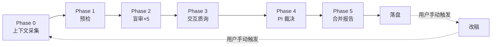

# `paper1-multi-agent-review` 技能优化建议

> **分析日期**: 2026-06-03  
> **技能版本**: v2.0（Cursor AI 直接执行）  
> **分析范围**: 技能包全部 10 个文件  
> **目标**: 评估工作流完善度、输出可操作性，提出优化建议

---

## 一、总体评价

### 1.1 设计完成度评分

| 维度 | 评分 (1-10) | 说明 |
|------|-------------|------|
| 工作流完整性 | **8/10** | Phase 0→5 流程清晰，但缺少质量回归验证与自动化可执行断言 |
| 角色设计合理性 | **8/10** | 七角色覆盖全面，但盲审"依次扮演"模式难以真正隔离认知偏见 |
| 输出可操作性 | **6/10** | 行动清单模板存在但缺乏改稿所需的具体 diff 指引和验收标准 |
| 改稿衔接紧密度 | **4/10** | `改稿衔接.md` 仅 12 行，过于简略，缺乏从评审到修改的结构化映射 |
| 可移植性 | **9/10** | 自包含设计优秀，config.example.md 清晰 |
| 迭代闭环能力 | **5/10** | 提及"新建 run_id 再跑一轮"但缺少 Round N vs Round N-1 差异对比机制 |

### 1.2 核心优势

1. **自包含可移植架构**：整个技能包可复制到其他项目，依赖最小化
2. **Phase 0 证据底座**：要求先扫描仓库建立上下文，避免凭空审稿
3. **盲审纪律**：明确要求各角色输出互不可见，Phase 3 后才交叉引用
4. **证据锚定原则**：Major 问题须带 tex 路径和 JSON 字段引用
5. **结构化输出模板**：12 个文件的清单与模板明确

### 1.3 核心不足（需优化）

1. **"指导下一步"能力薄弱**：行动清单仅为 checklist，缺少执行细节
2. **改稿衔接断裂**：评审输出 → 改稿执行之间缺乏结构化桥接
3. **无质量回归机制**：修改后无法自动验证是否引入新问题
4. **单 Agent 角色扮演的认知泄露**：同一个 LLM 依次扮演多角色，难以避免前一角色的判断影响后续角色
5. **缺乏评审质量自检**：无法判断评审本身是否遗漏关键问题

---

## 二、工作流完善度分析

### 2.1 现有工作流（Phase 0→5）



### 2.2 缺失环节

| 缺失环节 | 影响 | 建议补充 |
|----------|------|----------|
| **Phase 1.5 — 目标期刊适配分析** | 编辑审查缺少具体期刊 Author Guide 检查项 | 增加期刊规范清单（篇幅、格式、参考文献风格等） |
| **Phase 2 后 — 角色交叉验证** | 各审稿人可能遗漏对方视角的关键问题 | 增加"互审盲点补充"步骤 |
| **Phase 5.5 — 改稿规划生成** | 行动清单缺乏执行路径 | 自动生成"改稿执行计划"含 diff sketch |
| **Phase 6 — 回归验证** | 修改后无法自动确认问题已解决 | 增加"回归审查 checklist" |
| **轮次间差异对比** | Round 2 无法有效对比 Round 1 的 P0 是否关闭 | 增加 `diff-summary.md` 模板 |

### 2.3 盲审隔离性问题

当前设计让单个 Agent "依次扮演"各角色，存在以下风险：

- **前序偏见泄露**：审稿人 A 的判断在 Agent 上下文中残留，可能影响审稿人 B 的独立性
- **语气同质化**：同一个 LLM 难以真正模拟不同审稿风格
- **评分锚定效应**：先出分的角色会隐含影响后续角色的评分标准

**建议缓解措施**（详见第四节）：
- 在 SKILL.md 中增加"角色切换时的上下文隔离指令"
- 每个角色完成后要求 Agent 明确"遗忘"上一角色的评分和结论
- 可选：Phase 2 角色顺序随机化

---

## 三、输出可操作性评估

### 3.1 现有输出 vs 指导改稿所需

| 输出文件 | 可直接指导改稿？ | 差距 |
|----------|------------------|------|
| `00-上下文清单.md` | ❌ 仅为上下文 | — |
| `01-预检报告.md` | ⚠️ 部分可用 | 缺少修复步骤建议 |
| `02-审稿人*.md` | ⚠️ 部分可用 | 建议项多为方向性，缺少具体修改指引 |
| `03-交互质询纪要.md` | ❌ 仅记录分歧 | 未给出分歧的解决方案 |
| `04-PI综合裁决.md` | ✅ 较好 | 但"如何做"的细节不够 |
| `05-全面评审报告.md` | ⚠️ 综合但粗粒度 | 需要拆解为可执行步骤 |
| `行动清单.md` | ⚠️ 核心载体 | 缺少每个 AP 的验收标准和修改 sketch |
| `执行摘要.md` | ❌ 仅概览 | — |

### 3.2 关键差距：从"发现问题"到"修复问题"

当前技能的输出停留在**问题诊断**层面，缺乏**处方**层面的细节：

```
现状:  问题描述 + 位置 + "建议修改"（一句话）
期望:  问题描述 + 位置 + 修改方案（含 diff sketch / 改写示例 / 验收标准）
```

**示例对比**：

```markdown
# 现有（粗粒度）
### METHOD-M1: RTT 测量点定义不清
- 位置: sections/05_7_rtt.tex L45-52
- 建议: 明确 RTT 的测量起止点

# 期望（可执行）
### METHOD-M1: RTT 测量点定义不清
- 位置: sections/05_7_rtt.tex L45-52
- 问题: M1 (RTT) 缺少从"请求发出"到"响应接收"的精确定义
- 修改方案:
  1. 在 §3.2 方法论部分新增 RTT 定义段落
  2. diff sketch:
     ```diff
     + \paragraph{RTT Measurement Protocol}
     + We define round-trip time (RTT) as the elapsed time from ...
     ```
  3. 同步更新 Abstract 和 Table II 中的 M1 描述
- 验收标准: grep -c 'RTT' sections/03_system.tex >= 1
```

---

## 四、具体优化建议

### 优化 1：增强行动清单模板 — 加入修改 sketch 和验收标准

**文件**: `行动清单.md` 模板（在 `设计方案.md` 附录 A 和 `reference.md` 中更新）

**改动要点**：
- 每个 AP 增加 `修改 sketch` 字段（给出 diff 方向或改写示例）
- 增加 `验收命令` 字段（可自动化验证的 grep/count 命令）
- 增加 `关联文件` 列表（修改一处需同步修改的其他文件）

### 优化 2：强化改稿衔接文档

**文件**: `改稿衔接.md`

**改动要点**：
- 从 12 行扩展为完整的改稿工作流规范
- 定义"评审报告 → 改稿 session"的标准启动流程
- 增加 Point-by-Point Response Letter 模板
- 增加改稿后自检 checklist

### 优化 3：增加角色隔离指令

**文件**: `SKILL.md` 和 `设计方案.md`

**改动要点**：
- 在 Phase 2 执行规范中增加明确的"角色切换隔离协议"
- 要求 Agent 在每个角色完成后输出"角色退出声明"
- 可选的随机化扮演顺序

### 优化 4：增加回归验证模板

**新增文件**: `回归验证.md`

**改动要点**：
- 定义 Round N+1 审查时的对比模板
- 提供 P0 关闭验证的自动化命令
- 差异报告（`diff-summary.md`）模板

### 优化 5：增强 Phase 2 输出模板的可操作性

**文件**: `设计方案.md` §5 / `reference.md`

**改动要点**：
- Major Issue 模板增加 `修改 sketch` 和 `验收标准` 字段
- 要求每个 Major 至少给出 1 个具体的修改方向（不仅仅是"需要改进"）

### 优化 6：增加评审质量自检

**文件**: `设计方案.md` DoD 节

**改动要点**：
- 增加"评审覆盖度检查"：是否每个 section 至少被一个角色审查
- 增加"问题分布检查"：P0 分布是否合理（非全集中于一个维度）
- 增加"建设性检查"：确保不只是批评，而是有可操作的建议

---

## 五、优化优先级

| 优先级 | 优化项 | 预期效果 | 工作量 |
|--------|--------|----------|--------|
| **P0** | 优化 2：强化改稿衔接 | 直接提升"评审→改稿"闭环能力 | 中 |
| **P0** | 优化 1：增强行动清单模板 | 行动清单可直接驱动改稿 | 小 |
| **P1** | 优化 5：增强 Issue 模板 | 评审输出的可操作性提升 | 小 |
| **P1** | 优化 3：角色隔离指令 | 提升盲审质量 | 小 |
| **P2** | 优化 4：回归验证模板 | 支撑多轮迭代 | 中 |
| **P2** | 优化 6：评审质量自检 | 防止评审自身质量问题 | 小 |

---

## 六、实施计划

以下为建议的实施步骤：

1. **修改 `改稿衔接.md`** — 从 12 行扩展为完整的改稿工作流规范
2. **更新 `设计方案.md`** — 增强附录 A 行动清单模板、Phase 2 输出模板、DoD 自检项、角色隔离协议
3. **更新 `reference.md`** — 同步模板更新
4. **新增 `回归验证.md`** — 多轮迭代的回归对比模板
5. **更新 `SKILL.md`** — 反映新增文件和流程变更
6. **更新 `README.md`** — 同步文件清单
7. **更新 `索引说明.md`** — 同步文档对照表
