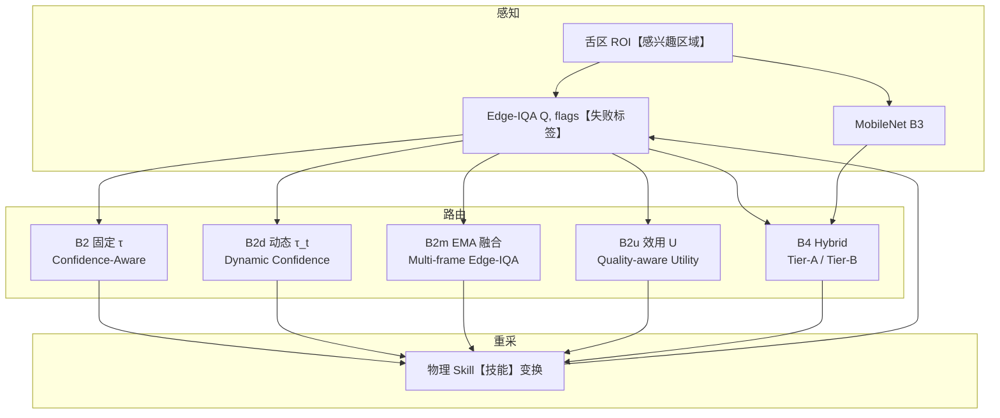

# 08 · 算法扩展详解（B2d / B2m / B2u + 物理重采 + Hybrid）

> **前置阅读**：[02_核心概念与技术原理.md](./02_核心概念与技术原理.md) §3–§4  
> **代码与数字依据**：`doctor/paper1/sim/resample_physics.yaml`、`langgraph_router/`、`experiments/results/algo_quick_summary.json` · 汇总见 [`doctor/paper1/docs/`](../../../doctor/paper1/docs/README.md)  
> **更新日期**：2026-06-04

---

## 0. 代号命名规则与英文术语表

### 0.0 英文词标注约定

正文与表格中的**英文关键词**（含代码字段名、路由名、超参名）在**首次出现或表格列头**处采用：

> `英文`【中文解释】

示例：`flags`【Edge-IQA 输出的失败标签列表】、`gain`【曝光校正增益，像素乘系数】、`bias`【曝光校正偏置，像素加偏移】。

实现相关高频词速查见 **§0.4**；代号与指标见 **§0.2–0.3**。

### 0.1 代号怎么读？

实验矩阵里 **`B` = Baseline（基线）**，**数字**表示方法谱系（B0 最弱 → B2 为论文主方法），**后缀单字母**表示在 **B2 骨架上**叠加的算法变体（仅改路由/打分逻辑，仍共用 Edge-IQA + LangGraph + 物理重采）：

| 模式 | 示例 | 含义 |
|------|------|------|
| `B` + 数字 | B0, B1, **B2**, B3, B4 | 独立基线，互相对照 |
| `B2` + 字母 | **B2d**, **B2m**, **B2u** | B2 的公式化扩展，用于消融与一区叙事 |
| `B3` + 字母 | B3t | B3 的阈值公平版（**t** = **threshold-calibrated**【阈值单独标定】） |

代码与 CSV 中 `baseline`【基线代号字段】与上表一一对应（如 `run_matrix_tcm.py` 里 `baseline=='B2d'`）。

### 0.2 本文核心代号（英文全称 + 解释）

| 代号 | 英文全称 | 中文简称 | 核心机制（一句话） |
|------|----------|----------|-------------------|
| **B2** | **Confidence-Aware Routing** with Edge-IQA | 置信度感知路由（主方法） | 固定阈值 \(\tau\)，\(Q_{img}\ge\tau\) 上传，否则边侧重采（LangGraph 闭环） |
| **B2d** | **Dynamic Confidence Routing** | 动态置信度路由 | **d** = *dynamic*：\(\tau_t\) 随 RTT、丢包率升高而升高，差网络下更保守地上传 |
| **B2m** | **Multi-frame Edge-IQA** (EMA fusion) | 多帧边侧 IQA 融合 | **m** = *multi-frame*：短 **burst**【连拍】多帧打分后经 **EMA**【指数移动平均】融合再路由，抑制单帧 **Laplacian**【拉普拉斯清晰度】抖动 |
| **B2u** | **Quality-aware Utility Routing** | 质量感知效用路由 | **u** = *utility*：用连续效用 \(U=w_1Q-w_2\mathrm{RTT}-w_3C\) 替代硬阈值 \(Q\ge\tau\) |
| **B4** | **Hybrid Edge Gating** | 混合边侧门控 | **Tier-A**【一级门控】用可解释 Edge-IQA，**Tier-B**【二级门控】用学习 IQA（MobileNet）消歧 **blur**【模糊】 |
| **B3** | Learned **IQA** (MobileNetV3-Small) @ \(\tau_{B2}\) | 学习 IQA（不公平阈值） | 深度学习打分器，阈值仍用 Edge 标定的 \(\tau_{B2}\)，尺度不匹配，仅作上界对照 |
| **B3t** | Learned IQA @ \(\tau_{B3}\) (**t**hreshold-calibrated) | 学习 IQA（公平阈值） | 与 B3 同网络，但 \(\tau_{B3}\approx0.5\) 单独标定，公平对比学习路由 |
| **B0** | Naive cloud-only baseline | 无脑上传基线 | 无边缘 IQA，帧一律上传云端再评判 |
| **B1** | Edge-IQA gate **without** resample loop | 无重采消融 | 有 IQA、固定 \(\tau\)，但**无** LangGraph 重采闭环 |

### 0.3 相关缩写与指标（答辩常问）

| 缩写 | 英文全称 | 中文 / 说明 |
|------|----------|-------------|
| **IQA** | Image Quality Assessment | 图像质量评估；本文边侧为 **Edge-IQA**（可解释 Laplacian+曝光） |
| **EMA** | Exponential Moving Average | 指数移动平均；B2m 用于融合 burst 内多帧 \(Q\) |
| **RTT** | Round-Trip Time | 往返时延；B2d/B2u 中既计入 M1，也进入 \(\tau_t\) 或效用 \(U\) |
| **ROI** | Region of Interest | 感兴趣区域；舌象实验中对舌框裁剪后再打分 |
| **TCM** | Traditional Chinese Medicine (imaging) | 中医舌象成像语境；主数据集 **ShezhenV3**，跨集泛化为 **TCM-FD** |
| **M1** | End-to-end closed-loop latency (p50/p95) | 闭环时延（采集→IQA→路由→动作） |
| **M2** | Valid acquisition / frame rate | 有效采集率（\(Q\ge\tau\) 且任务完成） |
| **M3** | Retry / invalid-upload rate | 重拍率或云端无效上传占比（越低越省带宽） |
| **Hybrid** | Hybrid gating (not a separate `B` number) | 指 B4 的 **Tier-A / Tier-B** 两级门控策略 |
| **物理重采** | Physics-informed edge resampling | 按 `flags`【失败标签】做曝光/去模糊等 **Skill**【具名机器人技能，如调曝光、减模糊】**等价** 图像变换，非随机抬高 \(Q\) |

### 0.4 实现与路由英文词速查（flag / gain / bias 等）

| 英文 | 【解释说明】 |
|------|----------------|
| **flag** / **flags** | Edge-IQA 判定的**失败标签**（如欠曝、过曝、模糊），决定物理重采走哪条 Skill 分支 |
| **gain** | **增益**：曝光校正时像素值乘以的系数（\>1 变亮） |
| **bias** | **偏置**：曝光校正时像素值加上的偏移量（正数整体提亮） |
| **blur** | **模糊**：清晰度不足；对应 `flags` 中的 `blur` 或走减 **Gaussian blur**【高斯模糊】半径分支 |
| **exposure_loop_tuning** | **曝光环调参**：物理重采 Skill 名，按 **gain**/**bias** 校正曝光 |
| **adaptive_visual_damping** | **自适应视觉阻尼**：物理重采 Skill 名，渐进减小模糊半径 |
| **segment** | **链路片段**：RTT 累计中的一段耗时（采集、IQA、传输等） |
| **p50** / **p95** | **分位数时延**：50%/95% 位置的延迟，比均值更抗离群 |
| **underexposed** | **欠曝**：画面过暗 |
| **overexposed** | **过曝**：画面过亮 |
| **poor_exposure** | **曝光不佳**：介于欠/过曝之间的曝光异常 |
| **upload** / **upload_cloud** | **上传云端**：质量合格时将帧送云端（路由决策名） |
| **resample** / **resample_edge** | **边侧重采**：质量不合格时在边侧触发重拍/Skill 变换（路由决策名） |
| **fail_safe** | **安全失败**：重拍次数超限后的兜底终止 |
| **capture** | **采集**：获取一帧图像（流程节点名） |
| **uplift** | **人为抬分**：离线仿真中随机加 \(Q\)，已废弃 |
| **burst** | **连拍突发**：B2m 中连续多帧 micro-capture |
| **clip** | **裁剪**：把数值限制在 \([\tau_{min},\tau_{max}]\) 等区间内 |
| **seed** | **随机种子**：控制可复现的延迟/丢包采样 |
| **retry_count** | **已重采次数**：当前 trial 内第几次重拍 |
| **skill_invoked** | **已调用 Skill**：日志字段，标记是否做过物理变换 |
| **Tier-A** / **Tier-B** | **一级/二级门控**：B4 中可解释 Edge-IQA vs 学习 MobileNet 两档 |
| **trade-off** | **权衡**：如用 M1 延迟换 M2 稳定 |
| **sweep** | **参数扫描**：网格化改变 RTT/丢包/λ 等并画曲线 |
| **naive** | **朴素基线**：最简单对照（如 B0 全上传） |
| **claim** | **论文主论点**：本文主张可部署、可审计的主贡献 |

> **记忆口诀**：**B2 部署，B2d 看网，B2m 看帧，B2u 看权衡**；B3/B4 是学习对照，不替代 B2 主 claim。

---

## 1. 为什么需要算法扩展？

论文 I 的**主 claim**【主论点】仍是 **B2**：可解释 Edge-IQA + LangGraph 三分叉路由 + 物理重采闭环。  
但在 SCI 投稿视角下，仅有「固定阈值 \(\tau\) + 二分类 **upload**【上传】/**resample**【重采】」容易被审稿人归类为**工程集成**，创新点不足。

本节提出三条**可公式化、可消融、可复现**的算法增强，均在 B2 骨架上叠加，不改变主部署路径：

| 代号 | 英文全称 | 中文名称 | 核心公式 | 解决什么问题 |
|------|----------|----------|----------|--------------|
| **（基础）** | Physics-informed edge resampling | 物理重采 | **Skill**【技能】等价图像变换 | 废弃随机 \(Q\) **uplift**【抬分】，诚实 M2 |
| **B2d** | **D**ynamic **C**onfidence **R**outing | 动态置信度路由 | \(\tau_t = f(\mathrm{RTT}, P_{loss})\) | 固定 τ 不适应网络波动 |
| **B2m** | **M**ulti-frame **E**dge-**IQA** | 多帧边侧 IQA（EMA） | \(Q_t = \lambda Q_{t-1} + (1-\lambda)Q_{img}\) | 单帧 **Laplacian**【拉普拉斯清晰度算子】误判 |
| **B2u** | **Q**uality-aware **U**tility routing | 质量感知效用路由 | \(U = w_1 Q - w_2 \mathrm{RTT} - w_3 C\) | 硬阈值无法权衡质量/延迟/代价 |
| **B4** | **H**ybrid **E**dge **G**ating | 混合边侧门控 | Tier-A / Tier-B 切换 | 可解释 + 学习 IQA 互补 |

> **答辩必答**：B2 是「我们推荐部署的方案」；B2d/B2m/B2u 是「算法层面的扩展与消融」；B3/B4 是「学习 IQA 对照」，不替代 B2 的主 **claim**【论点】。

---

## 2. 基础层：Physics-informed Edge Resampling（物理重采，所有 B2 系基线共用）

> **英文**：Physics-informed edge resampling · **含义**：按 Edge-IQA **`flags`【失败标签列表】** 做确定性曝光/去模糊变换，模拟实机 **Skill**【技能】重采效果，**非**随机抬高 \(Q\)。

### 2.1 问题：旧版随机 uplift【人为抬分】

早期离线矩阵在 **`resample_edge`【边侧重采决策】** 后直接执行：

```python
q += rng.uniform(0.15, 0.35)  # 已废弃
```

导致 B2 的 M2 虚高到 **1.0**，审稿人无法相信闭环真实有效。

### 2.2 现在：Skill【技能】等价变换

实现：`doctor/paper1/sim/resample_physics.py`  
配置：`experiments/configs/resample_physics.yaml`

每次重采后，根据 Edge-IQA 的 **`flags`【失败标签列表】** 对**清晰参考帧**做确定性变换，再重新打分：

```
resample_edge【边侧重采】
    ├─ flags【标签】含 under/over/poor_exposure【曝光类】
    │       → exposure_loop_tuning【曝光环调参 Skill】（gain【增益】/ bias【偏置】）
    └─ 否则（blur【模糊】）→ adaptive_visual_damping【自适应视觉阻尼 Skill】
            （减小 Gaussian blur【高斯模糊】半径）
```

**模糊分支**（核心逻辑）：

- 当前 **blur**【模糊】半径 \(r\) 乘以 \(\alpha \sim \mathrm{Uniform}(0.4, 0.6)\)
- 新半径 \(r' = \max(r_{min},\, \alpha \cdot r)\)
- 第 2 次重采时再乘一次 \(\alpha\)（渐进减 **blur**【模糊】）

**曝光分支**（示例参数；像素变换为 `out = clip(pixel * gain + bias, 0, 1)`）：

| flag【失败标签】 | gain【增益系数】 | bias【亮度偏置】 |
|------|------|------|
| underexposed【欠曝】 | 1.25 | +0.08 |
| overexposed【过曝】 | 0.85 | −0.05 |
| poor_exposure【曝光不佳】 | 1.10 | +0.03 |

### 2.3 效果

| 指标 | 旧版（随机 **uplift**【抬分】） | **quick**【快速抽样跑】（80 帧） | **全量 3 seeds**【3 个随机种子】 |
|------|---------------------|----------------|------------------|
| B2 M2 | 1.000 | ≈0.625 | **0.604** |
| B2 M1 p50【中位时延】 | ~348 ms | ≈208 ms | **208 ms** |
| 可审计性 | ❌ | ✅ | ✅ `skill_invoked`【是否调用 Skill】 |

---

## 3. B2d — Dynamic Confidence Routing（动态置信度路由）

> **代号**：**B2** + **d**（*dynamic*）· **英文**：Dynamic Confidence Routing · **代码**：`langgraph_router/dynamic_tau.py`

### 3.1 动机

固定 \(\tau\) 假设网络条件稳定。实际边–云链路中：

- **RTT**【往返时延】升高 → 上传失败概率增大，不应轻易 **`upload_cloud`【上传云端】**
- 丢包率 \(P_{loss}\)【丢包概率】升高 → 同上

**B2d** 让阈值随网络状态**自适应升高**（更严格才上传）。

### 3.2 公式

\[
\tau_t = \mathrm{clip}\Big(\tau_0 + \alpha \frac{\mathrm{RTT}_t}{\mathrm{RTT}_{ref}} + \beta P_{loss},\; [\tau_{min}, \tau_{max}]\Big)
\]

其中 **clip**【裁剪】把动态阈值限制在 \([\tau_{min}, \tau_{max}]\) 内，避免 \(\tau_t\) 过高或过低。

默认超参（`algo_enhance.yaml`【算法扩展配置】）：

| 参数 | 默认值 | 含义 |
|------|--------|------|
| \(\tau_0\) | 来自 `recommended_tau.json` | 基线 Edge-IQA 阈值 |
| \(\alpha\) | 0.08 | **RTT**【往返时延】灵敏度 |
| \(\beta\) | 0.25 | 丢包灵敏度 |
| \(\mathrm{RTT}_{ref}\) | 300 ms | 归一化参考 **RTT**【往返时延】 |
| \(P_{loss}\) | **Uniform**【均匀分布】(0, 0.15) | 离线仿真采样 |

### 3.3 代码路径

```
doctor/paper1/langgraph_router/dynamic_tau.py
    └── dynamic_tau(tau_0, rtt_ms, p_loss, ...)

experiments/run_matrix_tcm.py
    └── resolve_decision()  # baseline=='B2d' 时调用
```

### 3.4 决策流程（与 B2 的差异）

```
edge_iqa【边侧 IQA 打分】 → q_gate【门控用质量分】
    → 累计 rtt【往返时延】（含 capture【采集】/ iqa / 此前 segment【链路片段】）
    → 采样 p_loss【丢包率】
    → τ_t = dynamic_tau(τ_0, rtt, p_loss)
    → route(q_gate, r, τ_t, K)   # 仍用三分叉，仅 τ 动态；K【最大重采次数】
```

### 3.5 quick【快速跑】结果与解读

来源：`experiments/results/algo_quick_summary.json`（60 帧，**seed**【随机种子】=0）

| 指标 | B2 | B2d |
|------|-----|-----|
| M1 p50 | 211 ms | 209 ms |
| M2 | 0.600 | **0.550** |
| M3 | 0.417 | **0.467** |

**解读**：

- M2 略降、M3 略升 → 网络劣化时**更保守**，更多走重采 —— 符合设计。
- 创新点在于**可测试的网络自适应**，需 Phase 2 **RTT**【往返时延】/丢包 **sweep**【参数扫描】展示曲线，而非单点 M2。

### 3.6 导师可能问

**Q：RTT 高时 τ 升高，不是更难 **upload**【上传】吗？**  
A：正是。差网络下「勉强上传」浪费带宽且云端仍可能拒收；B2d 优先边侧 **resample**【重采】换质量，是**质量–带宽联合优化**，不是单纯追 M2。

**Q：\(P_{loss}\) 离线怎么采？**  
A：当前主矩阵用 **Uniform**【均匀分布】(0, 0.15) 随机采样；后续网络扰动实验将固定 RTT/丢包网格。

---

## 4. B2m — Multi-frame Edge-IQA（多帧边侧 IQA，EMA 融合）

> **代号**：**B2** + **m**（*multi-frame*）· **英文**：Multi-frame Edge-IQA with EMA fusion · **代码**：`langgraph_router/multi_frame_iqa.py`

### 4.1 动机

单帧 **Laplacian**【拉普拉斯清晰度算子】对：

- 舌面纹理（高频率细节）
- 微动 / 自动曝光波动
- **ROI**【感兴趣区域/舌框】边界裁剪

敏感，\(Q_{img}\) 可能在 \(\tau\) 附近**抖动**，导致误 **upload**【上传】或误 **resample**【重采】。

**B2m** 在路由前对短 **burst**【连拍突发】多帧做 **EMA**【指数移动平均】，平滑分数后再决策。

### 4.2 公式

\[
Q_t = \lambda Q_{t-1} + (1-\lambda)\, Q_{img}
\]

离线仿真（`multi_frame_iqa.py`）：

1. 已有当前帧真实 \(Q_{img}\)（Edge-IQA 打分）
2. 生成 **`burst_frames`【连拍帧数】**=3 个 **micro-score**【微帧分数】：\(Q_{img} + \mathcal{N}(0, \sigma^2)\)，\(\sigma=0.025\)
3. 按 \(\lambda=0.6\) 顺序 **EMA**【指数移动平均】融合 → \(Q_{gate}\)【门控质量分】
4. 额外计入 \((burst\_frames - 1)\) 次 IQA 延迟

### 4.3 默认超参

| 参数 | 值 | 说明 |
|------|-----|------|
| `burst_frames`【连拍帧数】 | 3 | 连续 **micro-capture**【微采集】次数 |
| `ema_lambda`【EMA 衰减系数】 | 0.6 | 历史权重（越大越平滑） |
| `noise_std`【噪声标准差】 | 0.025 | 离线 **jitter**【帧间抖动】模拟 |

### 4.4 代码路径

```
doctor/paper1/langgraph_router/multi_frame_iqa.py
    ├── ema_quality()
    ├── fuse_burst_scores()
    └── simulate_burst_scores()

run_matrix_tcm.py → fuse_multi_frame_q()  # baseline=='B2m'
```

### 4.5 quick【快速跑】结果与 trade-off【权衡】

| 指标 | B2 | B2m |
|------|-----|-----|
| M1 p50【中位时延】 | 211 ms | **280 ms**（+~69 ms） |
| M2 | 0.600 | **0.650** |
| M3 | 0.417 | 0.417 |

**解读**：

- **用延迟换稳定**：多帧 IQA 计入 **RTT**【往返时延】，M1 上升明显。
- M2 提升 5 个百分点（quick）→ 论文可写「Multi-frame fusion reduces **mis-route**【误路由】 under score noise【分数噪声】」。
- 实机部署需 **trade-off**【权衡】：**burst**【连拍】3 帧 × ~9 ms ≈ 27 ms 额外边侧计算，仍 < 35 ms 门槛。

### 4.6 参数敏感性（待做，答辩可预告）

| 扫描 | 预期 |
|------|------|
| \(\lambda \in \{0.3, 0.5, 0.7, 0.9\}\) | 过大 → 响应慢；过小 → 平滑不足 |
| `burst_frames` ∈ {1, 3, 5} | 帧数↑ → M2↑、M1↑ |

---

## 5. B2u — Quality-aware Utility Routing（质量感知效用路由）

> **代号**：**B2** + **u**（*utility*）· **英文**：Quality-aware Utility Routing · **代码**：`langgraph_router/utility_route.py`

### 5.1 动机

\(Q \geq \tau\) 是**硬阈值**，无法表达：

- 「质量略低但 RTT 已很高，不值得再重采」
- 「质量中等，重采代价 \(C\) 大，不如上传」

**B2u** 用连续效用函数 \(U\) 替代二元比较。

### 5.2 公式

\[
U = w_1 Q - w_2 \frac{\mathrm{RTT}}{\mathrm{RTT}_{ref}} - w_3 C
\]

当前实现（`utility_route.py`）：

- 决策时取 \(C=0\)（**upload**【上传】路径效用；\(C\)【重采代价】在扩展版才显式计入）
- 若 \(U \geq u^\*\) → **`upload_cloud`【上传云端】**
- 否则 → **`resample_edge`【边侧重采】**（\(C\) 隐含在「未 upload 则重采」）

默认权重：

| 参数 | 值 |
|------|-----|
| \(w_1\) | 1.0 |
| \(w_2\) | 0.15 |
| \(w_3\) | 0.35（用于扩展；当前 route 主分支 \(C=0\)） |
| \(u^\*\) | 0.42 |
| \(\mathrm{RTT}_{ref}\) | 300 ms |

### 5.3 与 B2 的对比

| | B2 | B2u |
|---|-----|-----|
| 决策边界 | 离散：\(Q=\tau\) | 连续：\(U=u^\*\) |
| RTT 影响 | 仅间接（累计延迟） | **直接进入效用** |
| 可解释性 | 高（一张图讲清） | 中（需解释权重） |

### 5.4 quick【快速跑】结果

| 指标 | B2 | B2u |
|------|-----|-----|
| M1 p50 | 211 ms | **205 ms** |
| M2 | 0.600 | **0.650** |
| M3 | 0.417 | **0.367** |

**解读**：

- M2 与 B2m 同为 0.65，但 **M3 最低** → 效用函数减少无效重采。
- M1 略低于 B2 → RTT 惩罚项抑制「过度重采–上传循环」。

### 5.5 后续扩展（EdgeProcess 第三分支）

曾规划三选一：**Upload** / **Resample** / **EdgeProcess**（轻量增强后仍不上云）。  
当前代码仅实现 **upload**【上传】 vs **resample**【重采】；**EdgeProcess**【边侧处理】可作为 Phase 3 扩展。

---

## 6. 相关扩展：Hybrid B4 与学习 IQA（B3/B3t）

虽非 B2d/m/u 系列，但与算法栈同一实验矩阵，答辩时常一并被问。英文术语见 **§0.2**。

### 6.1 B3 / B3t — Learned Image Quality Assessment（学习 IQA 对照）

| 基线 | 英文含义 | 打分器 | 阈值 | 用途 |
|------|----------|--------|------|------|
| **B3** | Learned IQA @ \(\tau_{B2}\) | MobileNetV3-Small | \(\tau_{B2}\)（Edge 标定） | 不公平对照：学习分数与 Edge 阈值尺度不匹配 |
| **B3t** | Learned IQA @ \(\tau_{B3}\)（**t** = threshold-calibrated） | 同上 | **\(\tau_{B3}\)**（单独标定 ≈0.5） | 公平学习 IQA 路由：阈值与 MobileNet 输出同尺度 |

**IQA** = Image Quality Assessment（图像质量评估）。B3 系列用 **深度学习** 替代 Edge-IQA 的 Laplacian+曝光公式，但路由仍走同一 LangGraph 三分叉。

MobileNet 概率极化（清晰≈1、模糊≈0），故 \(\tau_{B3}\) 取几何中点 0.5。

**quick**【快速跑】主矩阵：B3/B3t M2≈**0.95**，但 M1 p50≈320–340 ms（**CPU**【中央处理器】推理开销）。

### 6.2 B4 — Hybrid Edge Gating（混合边侧门控）

`langgraph_router/hybrid_route.py`：

```
if 曝光 flags【失败标签】 → Tier-A【一级门控】: Edge-IQA + τ_B2
elif retry_count【已重采次数】 == 0 → Tier-A（首帧快筛）
else → Tier-B【二级门控】: MobileNet + τ_B3（blur【模糊】消歧）
```

**设计思想**：首帧和曝光问题用**可解释** Edge-IQA；重采后的 **blur**【模糊】歧义用**学习** MobileNet。

**quick**【快速跑】：M2≈0.95，M1≈281 ms — 介于 B2 与 B3 之间。

---

## 7. 基线关系总图



---

## 8. 实验数字速查

### 8.1 全量主矩阵（定稿数字 · 2026-05-31）

`bash scripts/paper1_run_tcm_finish.sh` → `main_seed*.csv`

| Baseline | M1 p50 | M2 | 角色 |
|----------|--------|-----|------|
| B0 | 374 ms | 0.560 | **naive**【朴素：全上传】 |
| **B2** | **208 ms** | **0.604** | **主 claim**【主论点】 |
| B3 | 346 ms | 0.934 | @ τ_B2 |
| B4 | 343 ms | 0.936 | **Hybrid**【混合门控】 |

### 8.2 主矩阵 quick【快速抽样】（80 帧，趋势对照）

`bash scripts/paper1_run_tcm_quick.sh` → `quick_summary.json`

| Baseline | M1 p50 | M2 |
|----------|--------|-----|
| B2 | 208 ms | 0.625 |
| B4 | 281 ms | 0.95 |

### 8.3 算法消融 quick（60 帧）

`bash scripts/paper1_run_algo_quick.sh` → `algo_quick_summary.json`

| Baseline | M1 p50 | M2 | M3 |
|----------|--------|-----|-----|
| B2 | 211 ms | 0.60 | 0.417 |
| B2d | 209 ms | 0.55 | 0.467 |
| B2m | 280 ms | **0.65** | 0.417 |
| B2u | 205 ms | **0.65** | **0.367** |

> 以上为 **1 seed**【单随机种子】小样本；定稿以 **§8.1 全量** 为准。

---

## 9. 复现命令

```bash
# 全量（500 帧 × 3 seeds，~50 min）
bash scripts/paper1_run_tcm_full.sh
bash scripts/paper1_run_tcm_finish.sh   # 断点续跑

# 算法扩展单元测试
cd doctor/paper1
python3 -m pytest tests/test_algo_enhance.py tests/test_resample_physics.py -q

# quick 趋势（~2 min）
bash scripts/paper1_run_algo_quick.sh
bash scripts/paper1_run_tcm_quick.sh
```

**关键文件**：

```
doctor/paper1/
├── langgraph_router/
│   ├── dynamic_tau.py      # B2d
│   ├── multi_frame_iqa.py  # B2m
│   ├── utility_route.py    # B2u
│   └── hybrid_route.py     # B4
├── sim/resample_physics.py # 物理重采
└── experiments/
    ├── configs/algo_enhance.yaml
    ├── configs/resample_physics.yaml
    └── run_matrix_tcm.py
```

---

## 10. 答辩速答（算法扩展专题）

| 问题 | 推荐回答 |
|------|----------|
| B2d/B2m/B2u 英文分别是什么？ | **Dynamic Confidence Routing** / **Multi-frame Edge-IQA** / **Quality-aware Utility Routing**；后缀 d/m/u = dynamic / multi-frame / utility。 |
| 主方法和扩展的关系？ | B2（Confidence-Aware Routing）是可部署主路径；B2d/m/u 是同一 LangGraph 骨架上的公式化创新，用于消融与一区叙事。 |
| 为什么 M2 不再是 1.0？ | 物理重采替代随机 **uplift**【抬分】；全量 B2 M2=**0.604**。 |
| B4 比 B2 M2 高为什么不用 B4 作主 claim？ | B4 M2=0.936 但 M1 高约 135 ms + MobileNet；B2 适合审计与低延迟。 |
| 实机有没有跑 B2d/m/u？ | 当前为 ShezhenV3 离线重放 + 物理仿真；M6 辅轨为实机 **JSONL**【逐行 JSON 日志】，主定量见离线矩阵。 |
| flag / gain / bias 是什么？ | **flag**【失败标签】来自 Edge-IQA；重采时按标签选曝光 Skill 的 **gain**【增益】与 **bias**【偏置】，或走减 **blur**【模糊】半径分支。见 §2.2、§0.4。 |

---

## 11. 与论文章节对应

| 内容 | LaTeX 位置 |
|------|------------|
| 动态 τ / EMA / 效用公式 | `latex/sections/04_2_routing.tex` §4.2.1 |
| 算法消融表 | `latex/sections/05_3_ablation.tex` |
| Hybrid B4 | `latex/sections/table_iii.tex` |
| NR-IQA 附录 | `latex/sections/05_nr_iqa_baselines.tex` |
| Pareto M2–M1 | `figures/fig7_pareto_m2_m1.pdf` |
| 物理重采 | `04_2_routing.tex` + `sim/resample_physics.yaml` |

---

## 12. 后续工作（Phase 2–3）

1. ~~**网络扰动 sweep**~~：✅ quick 见 `doctor/paper1/experiments/results/network_sweep_quick.json` · [`验证结果_快速.md`](../../../doctor/paper1/docs/验证结果_快速.md) §3  
2. **upload 失败模型**：差网络下 B2 vs B2d 公平对比  
3. **λ / α / u\* 敏感性曲线**：Fig. 消融补充  
4. **跨数据集 TCM-FD**：τ 与 M2 泛化（`cross_tcm_fd.json`）  
5. **EdgeProcess** 第三分支：效用函数完整三选一  
6. ~~**全量 3 seeds**~~：✅ 见 [`验证结果_全量.md`](../../../doctor/paper1/docs/验证结果_全量.md)  
7. ~~**多智能体审核 P0–P2**~~：✅ `doctor/paper1/reviews/20260603-213904/`

复现索引：[`doctor/paper1/REPRODUCE.md`](../../../doctor/paper1/REPRODUCE.md)

---

## 关联阅读

- [02_核心概念与技术原理.md](./02_核心概念与技术原理.md) — 基线与路由入门（含 `flags` 标签定义）  
- [03_实验数据与图表解读.md](./03_实验数据与图表解读.md) — 图表叙事  
- [`doctor/paper1/docs/验证结果_全量.md`](../../../doctor/paper1/docs/验证结果_全量.md) — 定稿数字  
- [06_Edge-IQA算法详解与业界对比.md](./06_Edge-IQA算法详解与业界对比.md) — 感知层  
- [07_LangGraph与FSM对比深度分析.md](./07_LangGraph与FSM对比深度分析.md) — 编排层  
