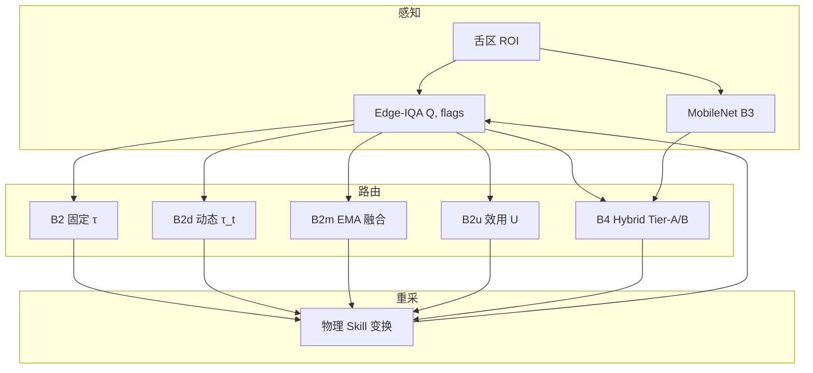

# 08 · 算法扩展详解（B2d / B2m / B2u + 物理重采 + Hybrid）

> **前置阅读**：[02_核心概念与技术原理.md](./02_核心概念与技术原理.md) §3–§4  
> **依据**：[PaperI_改进方案.md](../PaperI_改进方案.md)、[论文I_科研任务优化安排_20260530.md](../论文I_科研任务优化安排_20260530.md)  
> **更新日期**：2026-05-31（全量 3 seeds × 500 帧完成，物理重采定稿）

---

## 1. 为什么需要算法扩展？

论文 I 的**主 claim** 仍是 **B2**：可解释 Edge-IQA + LangGraph 三分叉路由 + 物理重采闭环。  
但在 SCI 投稿视角下，仅有「固定阈值 \(\tau\) + 二分类 upload/resample」容易被审稿人归类为**工程集成**，创新点不足。

改进方案（PaperI_改进方案 §1）提出三条**可公式化、可消融、可复现**的算法增强，均在 B2 骨架上叠加，不改变主部署路径：

| 代号 | 名称 | 核心公式 | 解决什么问题 |
|------|------|----------|--------------|
| **（基础）** | 物理重采 | Skill 等价图像变换 | 废弃随机 \(Q\) 抬升，诚实 M2 |
| **B2d** | Dynamic Confidence Routing | \(\tau_t = f(\mathrm{RTT}, P_{loss})\) | 固定 τ 不适应网络波动 |
| **B2m** | Multi-frame Edge-IQA | \(Q_t = \lambda Q_{t-1} + (1-\lambda)Q_{img}\) | 单帧 Laplacian 误判 |
| **B2u** | Quality-aware Utility | \(U = w_1 Q - w_2 \mathrm{RTT} - w_3 C\) | 硬阈值无法权衡质量/延迟/代价 |
| **B4** | Hybrid Gating | Tier-A / Tier-B 切换 | 可解释 + 学习 IQA 互补 |

> **答辩必答**：B2 是「我们推荐部署的方案」；B2d/B2m/B2u 是「算法层面的扩展与消融」；B3/B4 是「学习 IQA 对照」，不替代 B2 的主 claim。

---

## 2. 基础层：物理重采（所有 B2 系基线共用）

### 2.1 问题：旧版随机 uplift

早期离线矩阵在 `resample_edge` 后直接执行：

```python
q += rng.uniform(0.15, 0.35)  # 已废弃
```

导致 B2 的 M2 虚高到 **1.0**，审稿人无法相信闭环真实有效。

### 2.2 现在：Skill 等价变换

实现：`doctor/paper1/sim/resample_physics.py`  
配置：`experiments/configs/resample_physics.yaml`

每次重采后，根据 Edge-IQA 的 `flags` 对**清晰参考帧**做确定性变换，再重新打分：

```
resample_edge
    ├─ flags 含 under/over/poor_exposure → exposure_loop_tuning（gain/bias）
    └─ 否则（blur）→ adaptive_visual_damping（减小 Gaussian blur 半径）
```

**模糊分支**（核心逻辑）：

- 当前 blur 半径 \(r\) 乘以 \(\alpha \sim \mathrm{Uniform}(0.4, 0.6)\)
- 新半径 \(r' = \max(r_{min},\, \alpha \cdot r)\)
- 第 2 次重采时再乘一次 \(\alpha\)（渐进减 blur）

**曝光分支**（示例参数）：

| flag | gain | bias |
|------|------|------|
| underexposed | 1.25 | +0.08 |
| overexposed | 0.85 | −0.05 |
| poor_exposure | 1.10 | +0.03 |

### 2.3 效果

| 指标 | 旧版（随机 uplift） | quick（80 帧） | **全量 3 seeds** |
|------|---------------------|----------------|------------------|
| B2 M2 | 1.000 | ≈0.625 | **0.604** |
| B2 M1 p50 | ~348 ms | ≈208 ms | **208 ms** |
| 可审计性 | ❌ | ✅ | ✅ `skill_invoked` |

---

## 3. B2d — 动态置信度阈值

### 3.1 动机

固定 \(\tau\) 假设网络条件稳定。实际边–云链路中：

- RTT 升高 → 上传失败概率增大，不应轻易 `upload_cloud`
- 丢包率 \(P_{loss}\) 升高 → 同上

**B2d** 让阈值随网络状态**自适应升高**（更严格才上传）。

### 3.2 公式

\[
\tau_t = \mathrm{clip}\Big(\tau_0 + \alpha \frac{\mathrm{RTT}_t}{\mathrm{RTT}_{ref}} + \beta P_{loss},\; [\tau_{min}, \tau_{max}]\Big)
\]

默认超参（`algo_enhance.yaml`）：

| 参数 | 默认值 | 含义 |
|------|--------|------|
| \(\tau_0\) | 来自 `recommended_tau.json` | 基线 Edge-IQA 阈值 |
| \(\alpha\) | 0.08 | RTT 灵敏度 |
| \(\beta\) | 0.25 | 丢包灵敏度 |
| \(\mathrm{RTT}_{ref}\) | 300 ms | 归一化参考 RTT |
| \(P_{loss}\) | Uniform(0, 0.15) | 离线仿真采样 |

### 3.3 代码路径

```
doctor/paper1/langgraph_router/dynamic_tau.py
    └── dynamic_tau(tau_0, rtt_ms, p_loss, ...)

experiments/run_matrix_tcm.py
    └── resolve_decision()  # baseline=='B2d' 时调用
```

### 3.4 决策流程（与 B2 的差异）

```
edge_iqa → q_gate
    → 累计 rtt（含 capture / iqa / 此前 segment）
    → 采样 p_loss
    → τ_t = dynamic_tau(τ_0, rtt, p_loss)
    → route(q_gate, r, τ_t, K)   # 仍用三分叉，仅 τ 动态
```

### 3.5 quick 结果与解读

来源：`experiments/results/algo_quick_summary.json`（60 帧，seed=0）

| 指标 | B2 | B2d |
|------|-----|-----|
| M1 p50 | 211 ms | 209 ms |
| M2 | 0.600 | **0.550** |
| M3 | 0.417 | **0.467** |

**解读**：

- M2 略降、M3 略升 → 网络劣化时**更保守**，更多走重采 —— 符合设计。
- 创新点在于**可测试的网络自适应**，需 Phase 2 RTT/丢包 sweep 展示曲线，而非单点 M2。

### 3.6 导师可能问

**Q：RTT 高时 τ 升高，不是更难 upload 吗？**  
A：正是。差网络下「勉强上传」浪费带宽且云端仍可能拒收；B2d 优先边侧重采换质量，是**质量–带宽联合优化**，不是单纯追 M2。

**Q：\(P_{loss}\) 离线怎么采？**  
A：当前主矩阵用 Uniform(0, 0.15) 随机采样；后续网络扰动实验将固定 RTT/丢包网格。

---

## 4. B2m — 多帧 Edge-IQA（EMA 融合）

### 4.1 动机

单帧 Laplacian 对：

- 舌面纹理（高频率细节）
- 微动 / 自动曝光波动
- ROI 边界裁剪

敏感，\(Q_{img}\) 可能在 \(\tau\) 附近**抖动**，导致误 upload 或误 resample。

**B2m** 在路由前对短 burst 多帧做 **指数移动平均（EMA）**，平滑分数后再决策。

### 4.2 公式

\[
Q_t = \lambda Q_{t-1} + (1-\lambda)\, Q_{img}
\]

离线仿真（`multi_frame_iqa.py`）：

1. 已有当前帧真实 \(Q_{img}\)（Edge-IQA 打分）
2. 生成 `burst_frames=3` 个 micro-score：\(Q_{img} + \mathcal{N}(0, \sigma^2)\)，\(\sigma=0.025\)
3. 按 \(\lambda=0.6\) 顺序 EMA 融合 → \(Q_{gate}\)
4. 额外计入 \((burst\_frames - 1)\) 次 IQA 延迟

### 4.3 默认超参

| 参数 | 值 | 说明 |
|------|-----|------|
| `burst_frames` | 3 | 连续 micro-capture 数 |
| `ema_lambda` | 0.6 | 历史权重（越大越平滑） |
| `noise_std` | 0.025 | 离线 jitter 模拟帧间波动 |

### 4.4 代码路径

```
doctor/paper1/langgraph_router/multi_frame_iqa.py
    ├── ema_quality()
    ├── fuse_burst_scores()
    └── simulate_burst_scores()

run_matrix_tcm.py → fuse_multi_frame_q()  # baseline=='B2m'
```

### 4.5 quick 结果与 trade-off

| 指标 | B2 | B2m |
|------|-----|-----|
| M1 p50 | 211 ms | **280 ms**（+~69 ms） |
| M2 | 0.600 | **0.650** |
| M3 | 0.417 | 0.417 |

**解读**：

- **用延迟换稳定**：多帧 IQA 计入 RTT，M1 上升明显。
- M2 提升 5 个百分点（quick）→ 论文可写「Multi-frame fusion reduces mis-route under score noise」。
- 实机部署需权衡：burst 3 帧 × ~9 ms ≈ 27 ms 额外边侧计算，仍 < 35 ms 门槛。

### 4.6 参数敏感性（待做，答辩可预告）

| 扫描 | 预期 |
|------|------|
| \(\lambda \in \{0.3, 0.5, 0.7, 0.9\}\) | 过大 → 响应慢；过小 → 平滑不足 |
| `burst_frames` ∈ {1, 3, 5} | 帧数↑ → M2↑、M1↑ |

---

## 5. B2u — 质量感知效用函数路由

### 5.1 动机

\(Q \geq \tau\) 是**硬阈值**，无法表达：

- 「质量略低但 RTT 已很高，不值得再重采」
- 「质量中等，重采代价 \(C\) 大，不如上传」

**B2u** 用连续效用函数 \(U\) 替代二元比较。

### 5.2 公式

\[
U = w_1 Q - w_2 \frac{\mathrm{RTT}}{\mathrm{RTT}_{ref}} - w_3 C
\]

当前实现（`utility_route.py`）：

- 决策时取 \(C=0\)（upload 路径效用）
- 若 \(U \geq u^\*\) → `upload_cloud`
- 否则 → `resample_edge`（\(C\) 隐含在「未 upload 则重采」）

默认权重：

| 参数 | 值 |
|------|-----|
| \(w_1\) | 1.0 |
| \(w_2\) | 0.15 |
| \(w_3\) | 0.35（用于扩展；当前 route 主分支 \(C=0\)） |
| \(u^\*\) | 0.42 |
| \(\mathrm{RTT}_{ref}\) | 300 ms |

### 5.3 与 B2 的对比

| | B2 | B2u |
|---|-----|-----|
| 决策边界 | 离散：\(Q=\tau\) | 连续：\(U=u^\*\) |
| RTT 影响 | 仅间接（累计延迟） | **直接进入效用** |
| 可解释性 | 高（一张图讲清） | 中（需解释权重） |

### 5.4 quick 结果

| 指标 | B2 | B2u |
|------|-----|-----|
| M1 p50 | 211 ms | **205 ms** |
| M2 | 0.600 | **0.650** |
| M3 | 0.417 | **0.367** |

**解读**：

- M2 与 B2m 同为 0.65，但 **M3 最低** → 效用函数减少无效重采。
- M1 略低于 B2 → RTT 惩罚项抑制「过度重采–上传循环」。

### 5.5 后续扩展（改进方案 §1.3）

改进方案提到三选一：`Upload / Resample / EdgeProcess`。  
当前代码仅实现 upload vs resample；**EdgeProcess**（边侧轻量增强不上云）可作为 Phase 3 扩展。

---

## 6. 相关扩展：Hybrid B4 与学习 IQA（B3/B3t）

虽非 B2d/m/u 系列，但与算法栈同一实验矩阵，答辩时常一并被问。

### 6.1 B3 / B3t — 学习 IQA 对照

| 基线 | 打分器 | 阈值 | 用途 |
|------|--------|------|------|
| B3 | MobileNetV3-Small | τ_B2（Edge 标定） | 不公平对照：尺度不匹配 |
| B3t | 同上 | **τ_B3**（单独标定 ≈0.5） | 公平学习 IQA 路由 |

MobileNet 概率极化（清晰≈1、模糊≈0），故 τ_B3 取几何中点 0.5。

**quick 主矩阵**：B3/B3t M2≈**0.95**，但 M1 p50≈320–340 ms（CPU 推理开销）。

### 6.2 B4 — Hybrid Edge Gating

`langgraph_router/hybrid_route.py`：

```
if 曝光 flags → Tier-A: Edge-IQA + τ_B2
elif retry_count == 0 → Tier-A（首帧快筛）
else → Tier-B: MobileNet + τ_B3（blur 消歧）
```

**设计思想**：首帧和曝光问题用**可解释** Edge-IQA；重采后的 blur 歧义用**学习** MobileNet。

**quick**：M2≈0.95，M1≈281 ms — 介于 B2 与 B3 之间。

---

## 7. 基线关系总图



---

## 8. 实验数字速查

### 8.1 全量主矩阵（定稿数字 · 2026-05-31）

`bash scripts/paper1_run_tcm_finish.sh` → `main_seed*.csv`

| Baseline | M1 p50 | M2 | 角色 |
|----------|--------|-----|------|
| B0 | 374 ms | 0.560 | naive |
| **B2** | **208 ms** | **0.604** | **主 claim** |
| B3 | 346 ms | 0.934 | @ τ_B2 |
| B4 | 343 ms | 0.936 | Hybrid |

### 8.2 主矩阵 quick（80 帧，趋势对照）

`bash scripts/paper1_run_tcm_quick.sh` → `quick_summary.json`

| Baseline | M1 p50 | M2 |
|----------|--------|-----|
| B2 | 208 ms | 0.625 |
| B4 | 281 ms | 0.95 |

### 8.3 算法消融 quick（60 帧）

`bash scripts/paper1_run_algo_quick.sh` → `algo_quick_summary.json`

| Baseline | M1 p50 | M2 | M3 |
|----------|--------|-----|-----|
| B2 | 211 ms | 0.60 | 0.417 |
| B2d | 209 ms | 0.55 | 0.467 |
| B2m | 280 ms | **0.65** | 0.417 |
| B2u | 205 ms | **0.65** | **0.367** |

> 以上为 **1 seed 小样本**；定稿以 **§8.1 全量** 为准。

---

## 9. 复现命令

```bash
# 全量（500 帧 × 3 seeds，~50 min）
bash scripts/paper1_run_tcm_full.sh
bash scripts/paper1_run_tcm_finish.sh   # 断点续跑

# 算法扩展单元测试
cd doctor/paper1
python3 -m pytest tests/test_algo_enhance.py tests/test_resample_physics.py -q

# quick 趋势（~2 min）
bash scripts/paper1_run_algo_quick.sh
bash scripts/paper1_run_tcm_quick.sh
```

**关键文件**：

```
doctor/paper1/
├── langgraph_router/
│   ├── dynamic_tau.py      # B2d
│   ├── multi_frame_iqa.py  # B2m
│   ├── utility_route.py    # B2u
│   └── hybrid_route.py     # B4
├── sim/resample_physics.py # 物理重采
└── experiments/
    ├── configs/algo_enhance.yaml
    ├── configs/resample_physics.yaml
    └── run_matrix_tcm.py
```

---

## 10. 答辩速答（算法扩展专题）

| 问题 | 推荐回答 |
|------|----------|
| 主方法和扩展的关系？ | B2 是可部署主路径；B2d/m/u 是同一 LangGraph 骨架上的公式化创新，用于消融与一区叙事。 |
| 为什么 M2 不再是 1.0？ | 物理重采替代随机 uplift；全量 B2 M2=**0.604**。 |
| B4 比 B2 M2 高为什么不用 B4 作主 claim？ | B4 M2=0.936 但 M1 高约 135 ms + MobileNet；B2 适合审计与低延迟。 |
| 实机有没有跑 B2d/m/u？ | 当前为 ShezhenV3 离线重放 + 物理仿真；M6 辅轨为实机 JSONL，主定量见离线矩阵。 |

---

## 11. 与论文章节对应

| 内容 | LaTeX 位置 |
|------|------------|
| 动态 τ / EMA / 效用公式 | `latex/sections/04_2_routing.tex` §4.2.1 |
| 算法消融表 | `latex/sections/05_3_ablation.tex` |
| Hybrid B4 | `latex/sections/table_iii.tex` |
| 物理重采 | `04_2_routing.tex` + `sim/resample_physics.yaml` |

---

## 12. 后续工作（Phase 2–3）

1. ~~**网络扰动 sweep**~~：✅ quick 见 [论文I_网络扰动验证_20260530.md](../论文I_网络扰动验证_20260530.md)  
2. **upload 失败模型**：差网络下 B2 vs B2d 公平对比  
3. **λ / α / u\* 敏感性曲线**：Fig. 消融补充  
4. **跨数据集 TCM-FD**：τ 与 M2 泛化  
5. **EdgeProcess 第三分支**：效用函数完整三选一  
6. ~~**全量 3 seeds**~~：✅ 2026-05-31 完成，见 [论文I_全量验证结果_20260531.md](../论文I_全量验证结果_20260531.md)

详见 [论文I_科研任务优化安排_20260530.md](../论文I_科研任务优化安排_20260530.md)。

---

## 关联阅读

- [02_核心概念与技术原理.md](./02_核心概念与技术原理.md) — 基线与路由入门  
- [03_实验数据与图表解读.md](./03_实验数据与图表解读.md) — Table 数字  
- [06_Edge-IQA算法详解与业界对比.md](./06_Edge-IQA算法详解与业界对比.md) — 感知层  
- [07_LangGraph与FSM对比深度分析.md](./07_LangGraph与FSM对比深度分析.md) — 编排层  
