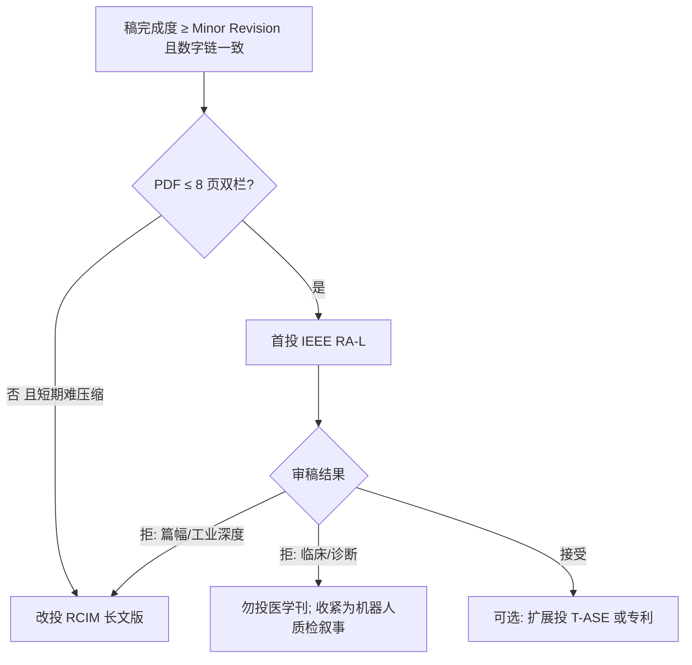

# 09 · 期刊选择与投稿策略

> **用途**：说明为何将 **IEEE RA-L** 与 **RCIM** 列为论文 I 首投组合，以及如何按期刊定位调整叙事与篇幅。  
> **关联**：[01_论文全景与定位.md](./01_论文全景与定位.md) · [05_导师拷问速答.md](./05_导师拷问速答.md) Q4 · `submission/RA-L_20260529/cover_letter.md`  
> **更新日期**：2026-06-04

---

## 1. 论文 I 主题摘要（匹配基准）

在选刊前，先把「本文卖什么」固定为可对照期刊 scope 的三层结构：

| 层次 | 论文 I 实际内容 | 审稿人期望类型 |
|------|-----------------|----------------|
| **问题** | 云–边–端协同下，机器人舌象采集的 **上行质量门控**（GIGO、带宽、RTT） | 应用动机清晰、可量化 |
| **方法** | **Edge-IQA**（边侧轻量打分）+ **LangGraph 置信度路由**（upload / resample / fail-safe，JSONL 可审计） | 系统/控制/自动化创新，非纯医学诊断 |
| **证据** | ShezhenV3-COCO **离线主矩阵**（B0–B4、Table II/III）+ FR3 **M6 辅轨**（不进主表） | 理论 + 实验验证；机器人读者能复现 |

**刻意不做**（避免错投医学/AI 专刊）：临床多中心、舌诊辨证、KG/EMR、阻抗控制、云侧大模型诊断。

---

## 2. IEEE RA-L 期刊定位

### 2.1 官方定位（RAS）

- **刊名**：*IEEE Robotics and Automation Letters*（简称 RA-L / RAL）。
- **学科归属**：IEEE Robotics and Automation Society（RAS）旗下 **Letter 型**期刊，与 *IEEE Transactions on Robotics (T-RO)*、*IEEE Transactions on Automation Science and Engineering (T-ASE)* 等同属机器人与自动化主线。
- **Scope 要点**（据 [RAS RA-L 作者说明](https://www.ieee-ras.org/publications/ra-l/ra-l-information-for-authors/)）：
  - 发表 **及时、简洁** 的同行评议文章；
  - 报道机器人与自动化领域的 **创新思想、未发表结果、重要理论发现与应用案例研究**；
  - 强调 **快速发表**（目标约 6 个月内决定；近年平均 sub-to-epub 约 4 个月量级）。
- **篇幅**：正文 **最多 6 页**（Letter 格式），可付费加 **最多 2 页**（总长 ≤ 8 页）；更长工作应转 T-RO / T-ASE / RA-M。
- **差异化**：可选 **ICRA / IROS / CASE** 等旗舰会 **同稿展示** 通道（录用后按 RAS 政策转投会议），适合需要社区可见度的机器人系统稿。

### 2.2 读者与审稿文化

| 维度 | RA-L 典型偏好 |
|------|----------------|
| 创新形态 | **系统 + 方法** 一体：机器人任务、感知/规划/控制、实验可核查 |
| 理论深度 | 不要求纯数学证明；但要求 **相对基线** 的清晰增益与局限 |
| 实验 | 仿真 + 硬件在环均可；**可复现脚本/数据** 加分 |
| 叙事 | **短、狠、一条主 claim**；避免「技术报告式」13 个子实验节 |
| 弱项 | 纯软件集成、无机器人语境、纯医学临床统计 |

---

## 3. RCIM 期刊定位

### 3.1 官方定位（Elsevier）

- **刊名**：*Robotics and Computer-Integrated Manufacturing*（RCIM）。
- **学科归属**：制造工程 × 机器人 × 计算机集成制造；SCI **中科院 1 区 / TOP** 常见（以当年分区表为准）。
- **Scope 要点**（据 [ScienceDirect 期刊页](https://www.sciencedirect.com/journal/robotics-and-computer-integrated-manufacturing) / Guide for Authors）：
  - 侧重将研究成果 **落地到工业相关** 的机器人、制造技术与 **创新制造策略**；
  - 偏好 **理论 + 实验验证** 的原创研究；
  - 欢迎方向包括：**工业机器人、人机协作制造、云制造、信息物理生产系统（CPPS）、制造大数据、智能制造/自适应制造、机器学习** 等。
- **明确 OUT of scope**：常规切削加工、纯供应链/资源优化、**纯理论或纯数学**（会建议转他刊）。
- **篇幅**：通常为 **长文**（无 RA-L 6 页硬上限），适合更完整的系统描述、多图多表、讨论与附录并入正文。

### 3.2 读者与审稿文化

| 维度 | RCIM 典型偏好 |
|------|----------------|
| 创新形态 | **制造/产线/单元级** 可部署技术；云–边–端、数字孪生、柔性单元 |
| 理论深度 | 需要 **工程可解释 + 实验**；过「会议短文」式铺垫会显得薄 |
| 实验 | 强调 **工业相关性**；真实设备或高保真仿真 + 指标（吞吐、良率、OEE 类比） |
| 叙事 | 可把 **医疗/服务机器人** 写成 **柔性检测单元** 或 **人机协作质检** 场景 |
| 弱项 | 无制造/机器人集成语境的纯算法、纯远程医疗 IT |

---

## 4. RA-L 与 RCIM 对照

| 对比项 | IEEE RA-L | RCIM |
|--------|-----------|------|
| 出版方 | IEEE RAS | Elsevier |
| 文章类型 | Letter（短） | Full article（长） |
| 典型页数 | 6+2 页上限 | 通常 10–15+ 页可接受 |
| 核心社区 | 机器人/自动化学者 | 制造、工业 4.0、机器人系统集成 |
| 审稿周期 | 偏快 | 相对更长、更严的「完整性」 |
| 与会议 | ICRA/IROS/CASE 可选 | 无同等级 RAS 绑定通道 |
| 博士开题对齐 | 机器人学主流出口 | 开题报告已列 RCIM / T-ASE 为一区候选 |

---

## 5. 与论文 I 主题的匹配分析

### 5.1 维度匹配表

| 论文 I 要素 | RA-L 匹配 | RCIM 匹配 | 说明 |
|-------------|-----------|-----------|------|
| **机器人闭环采集**（Skills、重拍、FR3 辅轨） | ⭐⭐⭐⭐ | ⭐⭐⭐⭐ | 两刊均认「机器人 + 感知 + 决策闭环」 |
| **边侧 IQA + 路由**（非 1 kHz 控制环内） | ⭐⭐⭐⭐ | ⭐⭐⭐ | RA-L 常见「感知–规划分层」；RCIM 喜 **CPPS / 边云协同单元** |
| **云–边–端架构** | ⭐⭐⭐ | ⭐⭐⭐⭐ | RCIM 明确欢迎 **cloud-based / cyber-physical** 制造系统 |
| **LangGraph 可审计状态机** | ⭐⭐⭐ | ⭐⭐⭐ | 机器人侧强调 **可测试/可日志**；制造侧强调 **可追溯质检流程** |
| **TCM 舌象应用** | ⭐⭐⭐ | ⭐⭐⭐ | 作 **案例研究** 成立；不宜写成临床疗效论文 |
| **离线主实验 + 仿真 RTT** | ⭐⭐⭐ | ⭐⭐⭐ | 两刊均接受，但须在 Discussion 标明 **M1 为模型、非实测 RTT** |
| **Edge-IQA 算法新颖性** | ⭐⭐ | ⭐⭐ | Laplacian+曝光属经典 IQA；**主卖点是系统路由与闭环指标**，非新 SOTA 网络 |
| **负分离度（−0.541）诚实报告** | ⭐⭐⭐⭐ | ⭐⭐⭐⭐ | 符合「严谨系统论文」；需在 Cover Letter 主动解释，避免被当成方法缺陷拒稿 |
| **无多中心临床** | ⭐⭐⭐⭐ | ⭐⭐⭐⭐ | 避免投 *IEEE T-MI* / *AIM* 类临床刊 |

### 5.2 综合匹配结论

- **RA-L**：与当前稿形态 **最接近**——机器人采集 + 边侧推理 + 闭环策略 + 可复现离线矩阵 + 短篇幅。Cover Letter 已按「robotic acquisition + edge inference + closed-loop policies」撰写（见 `cover_letter.md` §Suitability for RA-L）。
- **RCIM**：与 **云–边协同制造单元 / 质量门控产线** 叙事高度一致；适合在 RA-L 因 **篇幅** 或 **工业验证深度** 被拒后，**扩写** Related Work（CPPS、人机协作质检）、强化「部署路径 vs B3」讨论后转投。

---

## 6. 为何推荐 RA-L + RCIM（而非只押 T-ASE 或医学刊）

### 6.1 推荐这两刊的直接理由

1. **与 V19 投稿时间表一致**（2026-09-30）：RA-L 审稿与决定周期相对短，适合学位节点；RCIM 作为 **同方向一区备选**，无需改研究方向。
2. **与论文 I 三条贡献同构**：
   - 架构（边侧 IQA 门控）→ RCIM 的 **CPPS / 云制造** 语言 + RA-L 的 **robotics system** 语言；
   - 算法（置信度路由 + LangGraph）→ 两刊均接受 **编排/状态机** 类贡献，若压缩为一张 Fig.2 + JSONL 协议；
   - 验证（B0–B4 + FR3 辅轨）→ RA-L 重 **对比实验**；RCIM 可扩 **产线 KPI 类比**（有效帧率 ≈ 一次通过率）。
3. **与双仓工程对齐**：`franka_ros2` + `doctor/paper1` 的 **HTTP 边网关 + ROS Skills** 是典型 **机器人系统集成** 证据，RA-L/RCIM 审稿人熟悉，而纯医学刊期望 IRB/临床终点。
4. **与多智能体审核结论一致**（`reviews/20260603-213904/`）：当前稿 **Minor Revision 7.2/10**，编辑指出主要风险是 **RA-L 篇幅与 Discussion 体例**，而非科学方向错误——说明 **首投 RA-L 合理**，若修不完篇幅再 **平移叙事投 RCIM**。
5. **与博士开题表述一致**：开题一区目标含 **RCIM / T-ASE**；论文 I 首投 **RA-L → RCIM** 不违背开题，且 RA-L 录用可算机器人学高水平短文。

### 6.2 为何不将 T-ASE / 医学刊作为当前首投

| 期刊 | 关系 | 当前不首投的主要原因 |
|------|------|------------------------|
| **IEEE T-ASE** | 扩展稿/二投候选 | 更适合 **完整 CPS + 长文**；`docs-zh/paper1/论文I_SCI投稿改进方案_20260530.md` 曾标 T-ASE ⭐⭐⭐⭐，但要求 P0/P1 与更长系统叙事；当前投稿包已按 **RA-L 6 页** 瘦身 |
| **IEEE T-MI / AIM / JAMIA** | 论文 II 方向 | 论文 I 无临床金标准、无诊断 AUC；TCM 仅作 **motivation** |
| **IEEE IoT Journal / 通信类** | 弱匹配 | 缺通信协议创新；边云仅为架构背景 |
| **Pattern Recognition / CVPR 类** | 弱匹配 | Edge-IQA 非 representation learning 贡献 |

---

## 7. 期刊选择原则（可复用于论文 I/II）

在选刊时按 **五条原则** 打分，避免「只看影响因子」：

### 原则 1：问题域对齐（Scope Fit）

- 问：编辑能否在 **一期目次** 里找到相近论文（医疗机器人、边云机器人、视觉质检、柔性单元）？
- 论文 I：**是**（RA-L 医疗/服务机器人；RCIM 人机协作检测单元）。

### 原则 2：贡献形态对齐（Contribution Type）

- 问：主贡献是 **新定理 / 新网络 / 新系统 / 新临床证据** 中的哪一种？
- 论文 I：**新系统 + 可复现闭环策略** → Letter 或制造系统长文，**不是**新 IQA SOTA。

### 原则 3：证据链对齐（Evidence Chain）

- 问：期刊是否接受 **离线公开集主证据 + 机器人辅轨**？
- RA-L：**接受**（需压缩附录、主文一张 Pareto）。
- RCIM：**接受**（可扩 M6、真实失败样例附录）。

### 原则 4：篇幅与叙事成本（Page Budget）

- 问：现稿能否在 **不改科学结论** 的前提下满足页限？
- 当前：主文已合并为 **5 个实验节**；仍须 PDF 页数确认（编辑 EDIT-M2）。**RA-L 有裁剪成本**；**RCIM 裁剪压力小**。

### 原则 5：时间线与转投路径（Timeline & Fallback）

- 问：拒稿后能否 **一周内** 改投且 **不捏造新实验**？
- **RA-L → RCIM**：扩写讨论、强化工业部署与 CPPS 引用，**主表数字可复用**。
- **RA-L → T-ASE**：需扩成 **长文 + 更强 CPS 叙事**，周期更长，适合录用后扩展版。

**决策规则（论文 I 现行）**：

---

## 8. 首投与转投策略（执行层）

| 阶段 | 期刊 | 稿件动作 |
|------|------|----------|
| **首投（当前）** | IEEE RA-L | 使用 `submission/RA-L_20260529/`；Cover Letter 双刊抬头；关键词含 *Robotics*、*Automation*、*Computer vision*（RAS 列表前 2 个必选） |
| **并行准备** | RCIM 备选包 | 保留同一 `main.tex` 源；预备 **+30% 篇幅** 的 Related Work（CPPS、cloud manufacturing、visual inspection） |
| **转投触发** | → RCIM | ① 主编以篇幅拒；② 审稿人要求 **产线级/更多实机** 而短期无法满足 RA-L 页限；③ RA-L 建议「扩展后投 Transactions」且导师选 RCIM 而非 T-ASE |
| **扩展轨（非 9 月必做）** | T-ASE | 合并阻抗/曝光 Skill、更强实机、统一 CPS 图；与论文 II 时间线错开 |

### 8.1 按期刊微调叙事（同一套数字）

| 叙事句 | RA-L 强调 | RCIM 强调 |
|--------|-----------|-----------|
| 问题句 | Robotic **acquisition-time** quality gating for tele-TCM | **Cyber-physical** inspection cell for flexible tongue imaging |
| 方法句 | Edge gateway **outside 1 kHz loop**; auditable LangGraph router | **Cloud–edge** collaborative manufacturing; traceable QC state machine |
| 结果句 | B2 ↓ RTT p50、↑ M2 vs B0 on public corpus | Valid-frame rate as **first-pass yield** proxy; Pareto vs learned IQA |
| 局限句 | Simulated RTT; synthetic blur; M6 auxiliary | Industrial pilot scale; real motion blur; OEE-style metrics future work |

---

## 9. 风险与对策（与审核对齐）

| 风险 | 主要期刊 | 对策 |
|------|----------|------|
| 篇幅超限 | RA-L | 附录外置 `supplementary/`；Discussion 合并为 3–4 段；编译 PDF 页数确认 |
| 「像软件集成」 | RA-L / RCIM | 突出 **机器人闭环 + FR3 辅轨**；主 claim 放在 **路由与指标**，非 Laplacian 公式 |
| B2 vs B3 部署质疑 | RCIM 更敏感 | 主文/Cover Letter **Pareto（M2–M1）**；B3 作对照非主路径 |
| TCM 临床外推 | 两刊 | 坚持 **采集质量** 而非 **辨证准确率**；伦理声明保持「公开集、无新受试者」 |
| 负分离度 | 两刊 | Fig.3 + τ 折中 + 路由效果；**不声称** Edge-IQA 完美可分 |

---

## 10. 备选期刊简表（论文 I 相关）

| 期刊 | 匹配度 | 适用时机 |
|------|--------|----------|
| **IEEE RA-L** | ⭐⭐⭐⭐（首投） | 篇幅达标、系统贡献清晰 |
| **RCIM** | ⭐⭐⭐⭐（备选/长文） | 需更多工业叙事或 RA-L 篇幅拒 |
| **IEEE T-ASE** | ⭐⭐⭐（扩展） | 完整 CPS + 更长实验后 |
| **IEEE RA-M** | ⭐⭐ | 更偏综述/教程，非当前形态 |
| **Computers in Biology and Medicine** | ⭐⭐⭐ | 若强化 TCM+审计、弱化机器人 |
| **IEEE T-MR / AIM** | ⭐ | 论文 II（多 Agent/临床语义） |

> 注：`docs-zh/paper1/论文I_SCI投稿改进方案_20260530.md` 在 **P0 改稿前** 曾将 T-ASE 标为首选；**P0 完成后** 现行策略以 **RA-L 首投 + RCIM 备选** 为准，与本节一致。

---

## 11. 导师/答辩必背（期刊类）

1. **为什么 RA-L？** 机器人闭环采集 + 边侧推理 + 可复现实验，符合 RAS Letter 的 **系统型短文**；与 9 月节点和 ICRA/IROS 可选展示匹配。  
2. **为什么 RCIM？** 云–边–端质量门控可表述为 **制造单元/CPPS** 中的可追溯质检；长文容纳完整消融与工业讨论。  
3. **为什么不先投 T-ASE？** 当前证据链以 **离线主矩阵** 为主，稿已按 **6 页 Letter** 组织；T-ASE 更适合录用后的 **扩展版**，避免首投周期过长。  

**EN one-liner**：We target RA-L for a concise robotics systems letter and keep RCIM as a same-theme Q1 fallback with stronger manufacturing/CPS framing.

---

## 12. 维护与引用

| 资源 | 路径 |
|------|------|
| 投稿包 | `doctor/paper1/submission/RA-L_20260529/` |
| Cover Letter | `cover_letter.md` |
| 多智能体审核 | `doctor/paper1/reviews/20260603-213904/` |
| V19 规划 | `docs-zh/paper1/V19/科研规划_论文I_V19.md` §1.1 |

刷新学习手册时：若首投期刊或截止日变更，同步更新 [01_论文全景与定位.md](./01_论文全景与定位.md) 表头与 [05_导师拷问速答.md](./05_导师拷问速答.md) Q4。

---

**上一篇** ← [08_算法扩展详解.md](./08_算法扩展详解.md) · **返回目录** → [README.md](./README.md)
