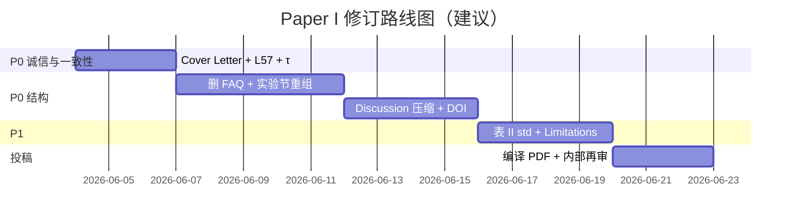

# Paper I 全面评审报告

**稿件**: *Confidence-Aware Edge Routing for Robotic TCM Tongue Imaging: Edge-IQA and LangGraph Closed-Loop Acquisition*  
**run_id**: `20260603-180038`  
**PAPER1_ROOT**: `doctor/paper1`  
**审核日期**: 2026-06-03  
**目标期刊**: IEEE RA-L / RCIM  

---

## 1. 元信息

| 项 | 内容 |
|----|------|
| 审核类型 | Cursor 多角色模拟审稿（非正式同行评审） |
| 主审语言 | 英文 `latex/sections/*.tex` |
| 中文抽查 | `sections/zh/` τ 与英文存在不一致 |
| 产出目录 | `reviews/20260603-180038/`（12 文件） |
| 是否改稿 | 否（仅报告） |

---

## 2. 执行摘要

见同目录 **`执行摘要.md`**。  
**PI 决定：Major Revision（6/10）** — 技术核心可站住，当前形态偏“技术报告”，需结构瘦身与投稿包诚信修正后方宜投稿。

---

## 3. 预检（Phase 1）

| ID | 状态 | 要点 |
|----|------|------|
| C1 | confirmed | 13 个实验子节 |
| C2 | confirmed | Discussion 19× `\paragraph{}` |
| C3 | confirmed | Cover Letter 错误；正文 Abstract/Table II/JSON **一致** |
| C4 | confirmed | 0/35 bib 有 DOI |
| C5 | confirmed | Reviewer FAQ 段落 |

**新发现**：Discussion “100%” vs M2=0.604；τ 0.498/0.465 混用。

详情 → `01-预检报告.md`

---

## 4. 分角色审稿摘要

### 🔍 审稿人 A（方法论）— 6/10，Major Revision

| 级别 | ID | 标题 |
|------|-----|------|
| Major | METHOD-M1 | 实验节过度碎片化 |
| Major | METHOD-M2 | τ setup 与主表冲突 |
| Major | METHOD-M3 | Discussion 100% 与数据矛盾 |
| Major | METHOD-M4 | 缺外部 IQA 定量基线 |

全文 → `02-审稿人A-方法论.md`

### 🔬 审稿人 B（领域）— 6/10，Major Revision

| 级别 | ID | 标题 |
|------|-----|------|
| Major | DOMAIN-M1 | 合成模糊限制临床外推 |
| Major | DOMAIN-M2 | Cover Letter 误导性数字 |
| Major | DOMAIN-M3 | 领域叙事被结构稀释 |

全文 → `02-审稿人B-领域.md`

### 📊 统计 — 5.5/10

- STAT-M1：主表缺 ±std  
- STAT-M2：Cover Letter 不一致  
- STAT-M3：τ 与消融 operating point  

→ `02-统计审查.md`

### ✍️ 编辑 — 5.5/10

- 篇幅、FAQ 体例、DOI、匿名稿  

→ `02-编辑审查.md`

### 📐 伦理 — 6/10

- AI 声明缺失；Cover Letter 诚信风险  

→ `02-伦理审查.md`

---

## 5. 交互质询（Phase 3）

| 议题 | 共识 | PI 裁决 |
|------|------|---------|
| CL-RTT | 修 Cover Letter、L57、M2 定义 | 不新增指标 |
| CL-STRUCT | 删 FAQ、附录化 walkthrough | deployment 压缩为 1 段 |
| CL-IQA | 主 claim= routing | NIQE 基线 P1 可选 |

→ `03-交互质询纪要.md`

---

## 6. 综合问题清单（P0 → P2）

### P0（7 项，修订接受前必须完成）

| # | 问题 | 证据 |
|---|------|------|
| 1 | Cover Letter 数值错误 | `cover_letter.md` L14 vs `table_ii.json` |
| 2 | Discussion “100%” 笔误 | `05_5_discussion.tex` L57 vs M2=0.604 |
| 3 | τ 0.498/0.465 不一致 | `05_1_setup.tex`, `recommended_tau.json` |
| 4 | 删除 Reviewer FAQ | `05_5_discussion.tex` L59–62 |
| 5 | 实验节合并/附录化 | `main.tex` 13× `05_*` |
| 6 | Discussion 段落压缩 | 19 `\paragraph{}` |
| 7 | 参考文献 DOI | `references.bib` |

### P1（强烈建议）

- Table II ±std；扩展 Limitations；AI 声明；中英 τ 同步；可选 NIQE 基线

### P2（可选）

- Graphical Abstract；CRediT；全篇 ref 检查

可勾选表 → **`行动清单.md`**

---

## 7. 亮点（保留与放大）

1. **问题重要**：TCM 舌象 GIGO + RTT 浪费在 tele-robotics 场景真实存在。  
2. **架构正确**：Edge-IQA + LangGraph 不侵入 1 kHz 控制回路。  
3. **证据可审计**：`table_ii.json` 与 Abstract 主指标对齐（三 seed 均值验证）。  
4. **学术诚实**：B3/B4 高 M2 与 B2 低 RTT/可解释性权衡表述清楚。  
5. **开源路径**：`doctor/paper1` + `franka_api_server` 降低复现门槛。

---

## 8. 修改路线图（建议 3 周）

**第 1 周**：AP-001–004（数字与 τ、FAQ）  
**第 2 周**：AP-005–007（结构、DOI）  
**第 3 周**：AP-008–010 + 可选 AP-011；双语同步  

---

## 9. 证据索引

| 主张 | 文件 | 字段/行 |
|------|------|---------|
| B0 M1 p50 ≈ 374 ms | `experiments/results/table_ii.json` | B0 seeds → mean |
| B2 M1 p50 ≈ 208 ms | 同上 | B2 seeds |
| B2 M2 ≈ 0.604 | 同上 | m2_valid_rate |
| ROI τ | `experiments/results/recommended_tau.json` | `"tau": 0.465` |
| Cover 错误 M2 | `submission/RA-L_20260529/cover_letter.md` | L14: 0.99 |
| FAQ 段落 | `latex/sections/05_5_discussion.tex` | L59 |
| 100% 笔误 | `latex/sections/05_5_discussion.tex` | L57 |
| 无 DOI | `latex/references.bib` | grep doi: 0 |
| M6 延迟 | `experiments/results/franka_m6_summary.json` | p50_ms: 7.38 |

---

## 10. 附件清单（本次 run）

| 文件 | Phase |
|------|-------|
| `00-上下文清单.md` | 0 |
| `01-预检报告.md` | 1 |
| `02-审稿人A-方法论.md` | 2 |
| `02-审稿人B-领域.md` | 2 |
| `02-统计审查.md` | 2 |
| `02-编辑审查.md` | 2 |
| `02-伦理审查.md` | 2 |
| `03-交互质询纪要.md` | 3 |
| `04-PI综合裁决.md` | 4 |
| `05-全面评审报告.md` | 5 ★ |
| `行动清单.md` | 4 |
| `执行摘要.md` | 5 ★ |

---

*本报告由 Cursor Agent 按 `paper1-multi-agent-review` 技能包生成，不构成期刊正式审稿意见。*
