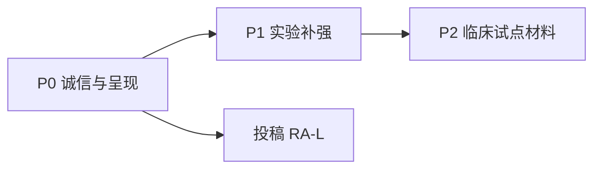

# Paper I 全面评审报告

**稿件**: *Confidence-Aware Edge Routing for Robotic TCM Tongue Imaging: Edge-IQA and LangGraph Closed-Loop Acquisition*  
**run_id**: `20260603-213904`  
**PAPER1_ROOT**: `doctor/paper1`  
**审核日期**: 2026-06-03  
**目标期刊**: IEEE RA-L / RCIM  
**审核类型**: Cursor 多角色模拟审稿（非正式同行评审）

---

## 1. 元信息

| 项 | 内容 |
|----|------|
| 主审语言 | 英文 `latex/sections/*.tex` |
| 中文抽查 | `sections/zh/00_abstract.tex` — 数字与英文一致 |
| 产出目录 | `reviews/20260603-213904/`（12 文件） |
| 是否改稿 | 否 |
| 上轮 run_id | `20260603-180038`（Major Revision 6/10） |

---

## 2. 执行摘要

见 **`执行摘要.md`**。

**PI 决定：Minor Revision（7.2/10）** — 相较上轮，投稿诚信与结构已达标；剩余工作集中在有效性威胁的集中呈现、Discussion 编辑化与参考文献规范。

---

## 3. 预检（Phase 1）

| ID | 状态 | 要点 |
|----|------|------|
| C1 | **fixed** | 正文 5 实验子节 + 附录扩展 |
| C2 | **confirmed**（缓解） | Discussion 8× paragraph |
| C3 | **fixed** | Abstract / Cover Letter / `table_ii.json` 一致 |
| C4 | **confirmed**（部分） | 28/43 bib 有 DOI |
| C5 | **fixed** | 无 Reviewer FAQ |

**新发现**: `separation_min_clear_max_blur=-0.541`；仿真 RTT 需图注强化。

详情 → `01-预检报告.md`

---

## 4. 分角色审稿摘要

### 🔍 审稿人 A（方法论）— 7.0/10，Major Revision

| 级别 | ID | 标题 |
|------|-----|------|
| Major | METHOD-M1 | 仿真延迟模型限制 M1 外推 |
| Major | METHOD-M2 | 标定负分离度需主文可视化 |
| Major | METHOD-M3 | 缺 NR-IQA 同协议基线 |
| Major | METHOD-M4 | M2 与下游分类器未关联 |

全文 → `02-审稿人A-方法论.md`

### 🔬 审稿人 B（领域）— 7.5/10，Minor Revision

| 级别 | ID | 标题 |
|------|-----|------|
| Major | DOMAIN-M1 | 合成 blur vs 真实运动模糊 |
| Major | DOMAIN-M2 | B2 vs B3 Pareto 叙事加强 |

全文 → `02-审稿人B-领域.md`

### 📊 统计 — 7.0/10，Minor Revision

- STAT-M1：3 seeds / 无 CI  
- STAT-M2：M2 与注入标签耦合  

→ `02-统计审查.md`

### ✍️ 编辑 — 7.0/10，Minor Revision

- EDIT-M1：Discussion paragraph 碎片化  
- EDIT-M2：附录仍长  
- EDIT-M3：bib DOI 未全覆盖  

→ `02-编辑审查.md`

### 📐 伦理 — 8.0/10

- 无阻断项；CRediT + AI + 公开数据声明完备  

→ `02-伦理审查.md`

---

## 5. 交互质询（Phase 3）

| 议题 | 结果 |
|------|------|
| CL-RTT | [共识] 保持 abstract 现有表述；Fig caption 加 simulated（PI 裁决） |
| CL-IQA | [共识] 主文链接负分离度 JSON |
| CL-STRUCT | [共识] 合并 Discussion；walkthrough 外置 |

→ `03-交互质询纪要.md`

---

## 6. 综合问题清单（P0→P2）

### P0（投稿前建议完成）

| ID | 问题 | 证据 | 行动 |
|----|------|------|------|
| P0-1 | ROI 分数重叠未可视化 | `recommended_tau.json` L8 | AP-001 |
| P0-2 | Discussion 8 段碎片化 | `05_5_discussion.tex` | AP-002 |
| P0-3 | 15 条 bib 无 DOI | `references.bib` grep | AP-003 |
| P0-4 | RTT 图未标 simulated | `05_2` Fig.5 caption | AP-004 |

### P1（强建议）

| ID | 问题 | 行动 |
|----|------|------|
| P1-1 | 无 NR-IQA 基线 | AP-005 |
| P1-2 | 无 bootstrap CI | AP-006 |
| P1-3 | B2/B3 Pareto 缺失 | AP-007 |
| P1-4 | 附录 walkthrough 过长 | AP-008 |
| P1-5 | M2 未分层 clear/blur | AP-009 |

### P2（可选增强）

| ID | 问题 | 行动 |
|----|------|------|
| P2-1 | 真实失败样例 | AP-010 |
| P2-2 | Graphical Abstract | AP-011 |
| P2-3 | 中文稿附录同步 | AP-012 |

**P0 共 4 项**（满足 DoD ≤7）

---

## 7. 亮点（保留）

1. **系统架构**：Edge-IQA + LangGraph 与 FR3/ROS2 解耦，工程可落地。  
2. **评估诚实**：B3/B4 高 M2 不掩盖 B2 低延迟主路径；M6 与 Table II 分离。  
3. **可复现包**：脚本、JSON、Cover Letter、CRediT/AI 声明形成完整投稿链。  
4. **本轮改稿成效**：消除 FAQ、错误 Cover Letter、实验节碎片化与匿名稿问题。

---

## 8. 修改路线图

| 阶段 | 工期建议 | 内容 |
|------|----------|------|
| 第 1 周 | P0 | AP-001–004 + 编译 PDF 页数 |
| 第 2–3 周 | P1 | NR-IQA、CI、Pareto、附录外置 |
| 投稿前 | P2 | 中文同步、Graphical Abstract |

---

## 9. 证据索引

| 声明 | 源文件 | 字段/位置 |
|------|--------|-----------|
| B0 M1 p50 ≈ 374 ms | `table_ii.json` | seeds 均值 373.98 |
| B2 M1 p50 ≈ 208 ms | `table_ii.json` | 208.32 |
| B2 M2 = 0.604 | `table_ii.json` | 0.604 均值 |
| τ_B2 = 0.465 | `recommended_tau.json` | `tau` |
| 负分离度 | `recommended_tau.json` | `separation_min_clear_max_blur` |
| M6 p50 | `franka_m6_summary.json` | 7.38 ms |
| Cover Letter 数字 | `submission/RA-L_20260529/cover_letter.md` | L28–31 |
| Discussion 段数 | `05_5_discussion.tex` | 8× `\paragraph` |
| DOI 覆盖 | `references.bib` | 28/43 |

---

## 10. 附件清单

| 文件 | Phase |
|------|-------|
| `00-上下文清单.md` | 0 |
| `01-预检报告.md` | 1 |
| `02-审稿人A-方法论.md` | 2 |
| `02-审稿人B-领域.md` | 2 |
| `02-统计审查.md` | 2 |
| `02-编辑审查.md` | 2 |
| `02-伦理审查.md` | 2 |
| `03-交互质询纪要.md` | 3 |
| `04-PI综合裁决.md` | 4 |
| `行动清单.md` | 4 |
| `执行摘要.md` | 5 |
| `05-全面评审报告.md` | 5 ★ |

---

*本报告由 `paper1-multi-agent-review` 技能生成；改稿流程见技能包 `改稿衔接.md`。*
